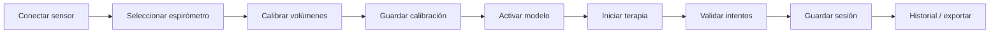

# RESPIRA+

Sistema de monitoreo, biofeedback y acompañamiento para **ejercicios respiratorios postoperatorios** con **espirómetro incentivador**. La app guía sesiones por niveles, estima volumen a partir del sensor óptico, registra adherencia y permite exportar datos para seguimiento clínico en contexto de desarrollo y validación.

**Stack:** Expo · React Native · TypeScript · Expo Router · AsyncStorage · ESP32 (Wi‑Fi / WebSocket) · VL53L0X.

**Nube (opcional / congelada):** la integración Supabase y auth online pueden permanecer desactivadas durante el trabajo con hardware local. Detalle: [README_CLOUD_FREEZE.md](README_CLOUD_FREEZE.md).

---

## Alcance clínico

- Dirigida a **pacientes adultos en rehabilitación respiratoria postoperatoria**, con espirómetro incentivador y ejercicios de volumen, tiempo sostenido y adherencia.
- **No sustituye** indicación médica, diagnóstico ni supervisión profesional.
- El sistema está en **desarrollo avanzado** y **pendiente de validación clínica**; no debe interpretarse como producto sanitario validado.

### Contexto del cambio de enfoque

El proyecto comenzó orientado a **EPOC**. Tras revisión con especialista en rehabilitación pulmonar, el equipo redirigió el producto hacia **postoperatorios**: volumen objetivo, sostenimiento, constancia y registro de sesiones con sensor. La arquitectura actual (perfiles de espirómetro, calibración por unidad física, terapia con validación conservadora) refleja ese enfoque.

---

## Estado actual

| Área | Estado |
|------|--------|
| Conexión global ESP32 (WebSocket) | Implementada (`SensorConnectionProvider`) |
| Perfiles 5000 mL / 3000 mL | Implementados |
| Calibración por `spirometerDeviceId` | Implementada |
| Modelo activo por espirómetro | Implementado |
| Incertidumbre metrológica (U95) | Implementada |
| Validación geométrica / repetibilidad / recaptura | Implementadas |
| Estimación de volumen en vivo | `useActiveVolumeEstimate` |
| Compuerta al iniciar terapia | `useTherapyReadinessGate` |
| Modo práctica táctil | Opt-in vía `EXPO_PUBLIC_ENABLE_TOUCH_PRACTICE_MODE` |
| Clasificación de sesiones | Sensor · Práctica · Sin clasificar |
| Historial / resumen / exportación | Distinguen origen y campos de sensor |
| Supabase / auth online | Opcional; por defecto **local-first** |

---

## Funcionalidades principales

- Conexión **ESP32** por WiFi (AP `RESPIRA_ESP32`) y **WebSocket** (`ws://192.168.4.1:81`).
- **Perfiles de espirómetro** (5000 mL y 3000 mL) y dispositivos físicos con calibración independiente.
- **Calibración** multi-volumen, repetibilidad, validación geométrica (perfil 5000 mL), incertidumbre **U95**.
- **Modelo activo** (`linear_regression` / `piecewise_linear`) por espirómetro.
- **Estimación de volumen** en calibración y en sesión.
- **Terapia guiada** (niveles) con validación al iniciar actividad.
- **Modo práctica táctil** (opcional, según configuración del dispositivo).
- **Historial**, **resumen** de sesión y **exportación clínica** (CSV / JSON, versión **2.1.0**).

---

## Arquitectura técnica

| Tecnología | Uso |
|------------|-----|
| **Expo ~54** | Toolchain, bundler, multiplataforma |
| **React Native** | UI |
| **TypeScript** | Tipado en `src/` |
| **Expo Router** | Rutas en `app/` |
| **AsyncStorage** | Persistencia local (sesiones, calibración, perfil) |
| **ESP32 + VL53L0X** | Distancia → volumen vía modelos calibrados |
| **WebSocket** | Un único cliente global en la app |
| **Supabase** | Opcional; congelado con `EXPO_PUBLIC_ENABLE_CLOUD_AUTH=false` |

Documentación de módulos:

- [Módulo device (sensor)](src/modules/device/README.md)
- [Módulo session (terapia)](src/modules/session/README.md)
- [Flujo del sensor](docs/sensor-flow.md)
- [Calibración](docs/calibration/README.md)
- [Auditoría técnica sensor / ESP32 / calibración (mayo 2026)](docs/AUDITORIA-TECNICA-SENSOR-ESP32.md)

---

## Flujo del sensor (resumen)



Detalle paso a paso: [docs/sensor-flow.md](docs/sensor-flow.md).

| Paso | Pantalla / ruta |
|------|-----------------|
| 1. Conectar | `/sensor-connection` |
| 2–5. Calibrar y modelo | `/sensor-calibration` |
| 6–7. Terapia y sesión | `/(tabs)/terapia` → `/(tabs)/sesion` |
| 8–9. Historial / exportación | `/(tabs)/historial`, `/(tabs)/resumen`, `/data-export` |

---

## Perfiles de espirómetro

Definidos en `src/modules/device/spirometer/spirometer-profiles.ts`.

| Concepto | Descripción |
|----------|-------------|
| **`SpirometerProfile`** | Plantilla de capacidad (5000 o 3000 mL), chips de volumen, rangos y reglas geométricas |
| **`SpirometerDevice`** | Unidad física (`spirometerDeviceId`); cada una tiene su propia calibración y modelo activo |
| **Calibración** | Se guarda por `spirometerDeviceId`, no por sesión |

| Perfil | ID | Rango recomendado | Geométrica |
|--------|-----|-------------------|------------|
| 5000 mL | `spirometer_5000ml_default` | 500–3000 mL (+ extendido hasta 5000) | Activada |
| 3000 mL | `spirometer_3000ml_default` | 500–3000 mL | Desactivada (pendiente medición física) |

**Agregar un espirómetro futuro:** crear entrada en `spirometer-profiles.ts`, registrar dispositivo en `spirometer-storage` / UI de selección, y ajustar `expectedDistanceStepMm` / `geometricValidationEnabled` cuando existan medidas físicas.

---

## Calibración

Procedimiento en `SensorCalibrationScreen` y servicios bajo `src/modules/device/calibration/`.

| Regla | Valor |
|-------|--------|
| Rango operativo (perfil 5000) | 500–3000 mL recomendado; extendido hasta 5000 mL |
| Volúmenes obligatorios | 6: 500, 1000, 1500, 2000, 2500, 3000 mL |
| Mediciones por volumen obligatorio | 5 |
| Puntos mínimos para terapia | 30 |
| Bloqueo por distancia | `distanceMm < 30` mm (VL53L0X inestable) |
| Repetibilidad | Desv. típica y variación de pendiente acotadas |
| Incertidumbre | U95 con factor k=2; umbral máximo 250 mL |
| Modelo activo | Uno por espirómetro; usado por `useActiveVolumeEstimate` |

Más detalle: [docs/calibration/README.md](docs/calibration/README.md).

---

## Modelos de estimación

| Modelo | Rol |
|--------|-----|
| **`linear_regression`** | Control de calidad y referencia simple |
| **`piecewise_linear`** | Recomendado cuando hay suficientes tramos y calidad |

Criterios relevantes (ver `calibration-model.ts` / `therapy-readiness-service.ts`):

- `isReadyForTherapy` — calibración y modelo aptos para sesión con sensor.
- `canEstimateWithinCalibratedRange` — volumen dentro del rango calibrado.
- **Modelo activo** persistido por espirómetro; la terapia no abre un segundo WebSocket.

Hook central: **`useActiveVolumeEstimate`** (`src/modules/device/volume-estimation/`).

---

## Terapia y sesión

| Modo | `inputMode` | `dataSource` | Validación oficial |
|------|-------------|--------------|-------------------|
| Sensor (por defecto) | `sensor` | `sensor_model` | `lowerBoundMl >= target` (conservador) + tiempo sostenido |
| Práctica táctil | `touch_practice` | `touch_simulation` | Simulación táctil; no mezclar con métricas de sensor |

- La **compuerta** al pulsar un nivel ejecuta `evaluateTherapyReadinessOnDemand` (conexión, modelo activo, rango).
- Con `EXPO_PUBLIC_ENABLE_TOUCH_PRACTICE_MODE=true`, si la compuerta falla puede ofrecerse **“Practicar sin sensor”**.
- Sesiones de práctica se marcan `is_practice_session: true` y se etiquetan en historial como **Práctica**.

---

## Historial y exportación

| Etiqueta UI | Condición |
|-------------|-----------|
| **Sensor** | `input_mode=sensor`, no práctica |
| **Práctica** | `touch_practice` / `is_practice_session` |
| **Sin clasificar** | Sesiones antiguas sin `input_mode` / `data_source` |

Exportación clínica: `CLINICAL_EXPORT_FORMAT_VERSION = '2.1.0'` — incluye clasificación, volúmenes estimados, U95, estado de intentos con sensor, etc. (`clinical-export-service.ts`, `clinical-csv-exporter.ts`).

---

## Variables de entorno

Copiar `.env.example` → `.env` ( **no subir** `.env` a Git).

| Variable | Default en ejemplo | Efecto |
|----------|-------------------|--------|
| `EXPO_PUBLIC_ENABLE_CLOUD_AUTH` | `false` | `false` = local-first sin login obligatorio |
| `EXPO_PUBLIC_ENABLE_OFFLINE_SENSOR_TEST` | `false` | Bypass de consentimiento en rutas de sensor (solo `__DEV__`) |
| `EXPO_PUBLIC_ENABLE_SENSOR_DEBUG` | `false` | Laboratorio de hardware y diagnóstico avanzado del sensor (solo `__DEV__`) |
| `EXPO_PUBLIC_ENABLE_TOUCH_PRACTICE_MODE` | `false` | Botón “Practicar sin sensor” en terapia |

Opcionales para nube (solo si se reactiva auth):

- `EXPO_PUBLIC_SUPABASE_URL`
- `EXPO_PUBLIC_SUPABASE_ANON_KEY`

En desarrollo local puedes usar `EXPO_PUBLIC_ENABLE_TOUCH_PRACTICE_MODE=true` en `.env`; **`.env.example` permanece con `false`** por seguridad.

---

## Comandos

```bash
npm install
npx expo start -c
npx expo start --web -c
npx tsc --noEmit
npm run lint
```

Atajos: `npm run android` · `npm run ios` · `npm run web`.

**No ejecutar** `npm audit fix --force` sin acuerdo del equipo (puede romper el SDK de Expo).

---

## Rutas principales (Expo Router)

| Ruta | Contenido |
|------|-----------|
| `/` → `app/index.tsx` | Gate inicial (local o nube) |
| `/(tabs)/index` | Inicio |
| `/(tabs)/terapia` | Niveles / terapia |
| `/(tabs)/sesion` | Sesión activa (barra oculta) |
| `/(tabs)/historial` | Historial |
| `/(tabs)/resumen` | Resumen post-sesión |
| `/sensor-connection` | Conexión global del sensor |
| `/sensor-calibration` | Calibración, modelo, U95 |
| `/profile` | Perfil |
| `/data-export` | Exportación |
| `/hardware-lab` | Hub de diagnóstico (según modo) |
| `/esp32-raw-test` | WebSocket mínimo (solo debug) |

---

## Hardware ESP32 (referencia)

| Elemento | Valor |
|----------|--------|
| AP SSID | `RESPIRA_ESP32` |
| IP | `192.168.4.1` |
| WebSocket | `ws://192.168.4.1:81` |
| Sensor | VL53L0X (GY-530), I2C `0x29` |
| Payload típico | `source`, `distanceMm`, `rawDistanceMm`, `distanceValid`, `timestamp` |

Firmware de referencia: `RESPIRA_WebSocket/`, `arduino_codes/`.

---

## Estructura de carpetas

```
app/                          # Rutas Expo Router (delgadas)
src/modules/
  app-mode/                   # Flags de entorno (nube, debug, touch practice)
  device/
    adapters/                 # useEsp32WebSocketSensor
    calibration/              # Modelos, storage, incertidumbre
    components/               # SensorLivePreview, etc.
    ingestion/                # parseSensorMessage
    mocks/                    # Lecturas simuladas (desarrollo)
    screens/                  # Conexión, calibración, Hardware Lab
    spirometer/               # Perfiles y dispositivos
    state/                    # SensorConnectionProvider, snapshots
    volume-estimation/        # useActiveVolumeEstimate, compuerta terapia
    websocket/                # Esp32WebSocketClient (único transporte)
  session/
    engine/                   # Nivel 1, touch adapter
    games/                    # UI de juego / hints de volumen
    screens/                  # SessionScreen
    sensor-evaluation/        # Validación oficial de intentos
    storage/                  # AsyncStorage sesiones
    types/ utils/ registry/
  history/ export/ summary/ home/
  levels/ patient/ legal/ diagnostics/
  auth/ notifications/ plans/ clinician/  # clinician: placeholders futuros
src/shared/                   # UI transversal, tema
src/theme/                    # Tokens (niveles, dashboards)
docs/                         # sensor-flow, calibración, Supabase
```

---

## Seguridad, privacidad y límites

- Los **avisos legales**, límites de uso, consentimiento y privacidad se concentran en el **documento legal** (PDF) accesible desde la app (aceptación inicial y Perfil).
- Las pantallas operativas muestran solo mensajes **funcionales** (sensor, calibración, práctica).
- **Consentimiento** digital antes de Terapia, Historial y sensor.
- Supabase en modo desarrollo: leer [docs/supabase-security-notes.md](docs/supabase-security-notes.md).

---

## Roadmap técnico (sugerido)

1. Pruebas de extremo a extremo (sensor → calibración → terapia → exportación).
2. Optimización de UI y copy clínico en flujos de paciente.
3. Integración clínica final y política de datos en nube.
4. Refinamiento de niveles 2–5 y dificultades.
5. Validación con usuarios y especialistas.
6. Documentación regulatoria (cuando aplique).

---

## Documentación adicional

- [Congelación de nube](README_CLOUD_FREEZE.md)
- [Seguridad Supabase (desarrollo)](docs/supabase-security-notes.md)
- [Arquitectura](src/docs/architecture.md)
- [Reparto por módulos](src/docs/team-ownership.md)

## Script `reset-project`

`npm run reset-project` proviene del template de Expo. **No ejecutarlo** sin leer `scripts/reset-project.js`.

## Aviso

RESPIRA+ es software en desarrollo para apoyo al ejercicio respiratorio. **No sustituye** valoración médica ni atención de urgencias.
