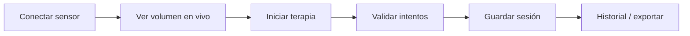

# RESPIRA+

Sistema de monitoreo, biofeedback y acompañamiento para **ejercicios respiratorios postoperatorios** con **espirómetro incentivador**. La app guía sesiones por niveles, estima volumen a partir del sensor óptico, registra adherencia y permite exportar datos para seguimiento clínico en contexto de desarrollo y validación.

**Stack:** Expo · React Native · TypeScript · Expo Router · AsyncStorage · ESP32 (Wi‑Fi / WebSocket) · VL53L0X.

**Nube (opcional / congelada):** la integración Supabase y auth online pueden permanecer desactivadas durante el trabajo con hardware local. Detalle: [README_CLOUD_FREEZE.md](README_CLOUD_FREEZE.md).

---

## Alcance clínico

- Dirigida a **pacientes adultos en rehabilitación respiratoria postoperatoria**, con espirómetro incentivador y ejercicios de volumen, tiempo sostenido y adherencia.
- **No sustituye** indicación médica, diagnóstico ni supervisión profesional.
- El sistema está en **desarrollo avanzado** y **pendiente de validación clínica**; no debe interpretarse como producto sanitario validado.

### Contexto del cambio de enfoque

El proyecto comenzó orientado a **EPOC**. Tras revisión con especialista en rehabilitación pulmonar, el equipo redirigió el producto hacia **postoperatorios**: volumen objetivo, sostenimiento, constancia y registro de sesiones con sensor. La arquitectura actual (perfiles de espirómetro, calibración por unidad física, terapia con validación conservadora) refleja ese enfoque.

### Qué mide y registra (versión actual)

| Variable | Descripción |
|----------|-------------|
| **Volumen inspirado estimado** | mL calculados en la app a partir de `distanceMm` y calibración activa |
| **Tiempo de inspiración sostenida** | Por intento y promedios de sesión |
| **Repeticiones válidas / inválidas** | Según reglas de sesión y evaluación |
| **Cumplimiento y consistencia** | Porcentajes y resúmenes agregados en historial |
| **Adherencia** | Historial de sesiones, rachas, calendario |
| **Metadatos de sensor y calibración** | Trazabilidad en sesiones oficiales (modelo, dispositivo, firmware) |

### Qué no mide

- **Presión inspiratoria** (PIP, MIP, cmH₂O u otras métricas de presión).
- Flujo espiratorio clínico certificado independiente del espirómetro con sensor óptico acoplado.

### Qué no hace

- **No diagnostica** condiciones respiratorias ni sustituye pruebas clínicas formales.
- **No prescribe** ni ajusta tratamiento de forma autónoma.
- **No sustituye** al profesional de la salud, urgencias ni indicación médica individual.

---

## Estado actual

| Área | Estado |
|------|--------|
| Conexión global ESP32 (WebSocket) | Implementada (`SensorConnectionProvider`) |
| Espirómetro activo | **RESPIRA+ 3000 mL** (único perfil en flujo paciente) |
| Calibración predeterminada | Modelo lineal validado por el equipo; clamp **0–3000 mL** |
| Estimación de volumen | **En la app** (`distanceMm` → mL); el ESP32 solo envía distancia |
| Calibración técnica multi-volumen | Implementada; **oculta** con `EXPO_PUBLIC_ENABLE_TECHNICAL_CALIBRATION=false` |
| Incertidumbre metrológica (U95) | Implementada; visible solo en modo técnico/debug |
| Validación geométrica / repetibilidad | Implementadas (modo técnico; perfil legacy 5000 mL) |
| Estimación de volumen en vivo | `useActiveVolumeEstimate` |
| UI paciente — volumen en conexión | Termómetro visual 0–3000 mL (`VolumeThermometer`) |
| Terapia — lecturas obsoletas | Bloqueadas; no se reutiliza el último volumen si la señal no está viva |
| Compuerta al iniciar terapia | `useTherapyReadinessGate` |
| Modo práctica táctil | Opt-in vía `EXPO_PUBLIC_ENABLE_TOUCH_PRACTICE_MODE` |
| Clasificación de sesiones | Sensor · Práctica · Sin clasificar |
| Historial / resumen / exportación | Distinguen origen; export técnico solo en modo técnico/debug |
| Supabase / auth online | Opcional; por defecto **local-first** |

### Modelo lineal predeterminado (RESPIRA+ 3000 mL)

Calibración de banco validada el **2 de junio de 2026** (`cal-predefined-respira-3000-v20260602`):

```
Volumen (mL) = 28.66324925966009 × distanceMm − 523.8262554875091
```

Resultado acotado entre **0** y **3000 mL** (valores < 0 se muestran como 0 mL; valores > 3000 pueden mostrarse como sobre rango visual). Constantes en `predefined-calibration-models.ts`.

### Legacy (no activo en flujo paciente)

| Elemento | Notas |
|----------|--------|
| Perfil 5000 mL | Conservado en código/storage para migraciones; no es opción activa |
| Opción «Otro» espirómetro | Eliminada del flujo paciente |
| Calibración técnica en UI | Disponible solo con `EXPO_PUBLIC_ENABLE_TECHNICAL_CALIBRATION=true` |

---

## Funcionalidades principales

- Conexión **ESP32** por WiFi (AP `RESPIRA_ESP32`) y **WebSocket** (`ws://192.168.4.1:81`).
- **Espirómetro RESPIRA+ 3000 mL** con calibración lineal predeterminada instalada al primer uso.
- El **firmware envía distancia** (`distanceMm`, `rawDistanceMm`, `distanceValid`); la **app calcula el volumen** en mL.
- **Pantalla de conexión** con termómetro visual de volumen (0–3000 mL) y estado de señal en tiempo real.
- **Calibración técnica** multi-volumen, repetibilidad, U95 y export CSV — solo con flag de modo técnico.
- **Terapia guiada** (niveles) con validación al iniciar actividad y bloqueo de lecturas obsoletas.
- **Modo práctica táctil** (opcional, según configuración del dispositivo).
- **Historial**, **resumen** de sesión y **exportación clínica** (CSV / JSON, versión **2.4.0**).

---

## Arquitectura técnica

| Tecnología | Uso |
|------------|-----|
| **Expo ~54** | Toolchain, bundler, multiplataforma |
| **React Native** | UI |
| **TypeScript** | Tipado en `src/` |
| **Expo Router** | Rutas en `app/` |
| **AsyncStorage** | Persistencia local (sesiones, calibración, perfil) |
| **ESP32 + VL53L0X** | Distancia por WebSocket; volumen calculado en app |
| **WebSocket** | Un único cliente global en la app |
| **Supabase** | Opcional; congelado con `EXPO_PUBLIC_ENABLE_CLOUD_AUTH=false` |

### Módulos principales (`src/modules/`)

| Módulo | Rol |
|--------|-----|
| `device/` | ESP32, WebSocket, calibración, estimación de volumen |
| `session/` | Terapia, sesión, intentos, juego, persistencia, desbloqueo de niveles |
| `diagnostics/` | Evaluación inicial (VIM) y generación de niveles personalizados |
| `history/` | Historial y agregados |
| `export/` | Exportación clínica y técnica |
| `legal/` | Consentimiento y documentos legales |
| `notifications/` | Recordatorios locales |
| `patient/` | Perfil, preferencias, sesión de paciente |
| `home/`, `levels/`, `summary/` | Inicio, selección de niveles, resumen post-sesión |
| `auth/`, `onboarding/` | Acceso y bienvenida |

Documentación de módulos y arquitectura:

- [Overview del producto](docs/00-overview/README.md)
- [Índice de arquitectura](docs/01-app-architecture/README.md)
- [Arquitectura técnica](src/docs/architecture.md)
- [Seguridad clínica y lenguaje](docs/08-clinical-safety/README.md)
- [Dispositivo y sensor](docs/04-device-and-sensor/README.md)
- [Calibración (índice central)](docs/05-calibration/README.md)
- [Datos y almacenamiento](docs/06-data-and-storage/README.md)
- [Módulo device (sensor)](src/modules/device/README.md)
- [Módulo session (terapia)](src/modules/session/README.md)
- [Flujo del sensor (legacy)](docs/sensor-flow.md) · [versión central](docs/04-device-and-sensor/sensor-flow.md)
- [Calibración (legacy)](docs/calibration/README.md)
- [Auditoría técnica sensor / ESP32 / calibración (mayo 2026)](docs/AUDITORIA-TECNICA-SENSOR-ESP32.md)

---

## Flujo del sensor (resumen)



En flujo paciente la calibración predeterminada RESPIRA+ 3000 mL se instala automáticamente; no requiere pasos manuales. La calibración técnica multi-volumen está disponible solo con `EXPO_PUBLIC_ENABLE_TECHNICAL_CALIBRATION=true`.

Detalle paso a paso: [docs/sensor-flow.md](docs/sensor-flow.md).

| Paso | Pantalla / ruta |
|------|-----------------|
| 1. Conectar + volumen en vivo | `/sensor-connection` |
| 2. Terapia y sesión | `/(tabs)/terapia` → `/(tabs)/sesion` |
| 3. Historial / exportación | `/(tabs)/historial`, `/(tabs)/resumen`, `/data-export` |
| Calibración técnica (solo flag) | `/sensor-calibration` |

---

## Flujo general del usuario (local-first)

```mermaid
flowchart TD
  A[Arranque app/index.tsx] --> B{¿Paciente local?}
  B -->|No| C[/auth/local-profile]
  B -->|Sí| D[/(tabs) Inicio]
  C --> E[/legal/accept]
  E --> D
  D --> F{¿Evaluación inicial?}
  F -->|No| G[/diagnostico]
  G --> H[/diagnostico-resumen]
  H --> I[/(tabs)/terapia]
  F -->|Sí| J{¿Sensor + calibración listos?}
  J -->|Sí| K[/(tabs)/sesion sensor]
  J -->|No + touch habilitado| L[/(tabs)/sesion touch_practice]
  K --> M[/(tabs)/resumen]
  M --> N[/(tabs)/historial]
  D --> O[/data-export]
```

| Etapa | Requisito principal |
|-------|---------------------|
| Perfil local | Crear paciente en `/auth/local-profile` |
| Consentimiento | Activo para Terapia, Historial, sensor, export, notificaciones |
| Evaluación inicial | `hasDiagnostic()` para CTAs de terapia |
| Sesión oficial | Sensor conectado, calibración RESPIRA+ 3000 mL, readiness OK |
| Desbloqueo de nivel | 6 sesiones **perfectas** acumuladas con sensor en nivel activo |
| Práctica táctil | Flag env + preferencia en Perfil; **no desbloquea** niveles |

**Requiere revisión manual:** en modo local-first, el arranque no revalida consentimiento retirado (solo cloud). Ver [docs/08-clinical-safety/README.md](docs/08-clinical-safety/README.md).

---

## Perfil de espirómetro activo

Definido en `src/modules/device/spirometer/spirometer-profiles.ts` y `predefined-calibration-models.ts`.

| Concepto | Descripción |
|----------|-------------|
| **`SpirometerDevice`** | Unidad física RESPIRA+ 3000 mL (`spirometerDeviceId`) |
| **Calibración predeterminada** | Modelo lineal validado; se instala con `ensureRespira3000PredefinedCalibrationInstalled` |
| **Clamp de volumen** | 0–3000 mL en estimación y UI |
| **Cálculo de volumen** | En la app a partir de `distanceMm`; el ESP32 no envía volumen clínico |

| Perfil activo | ID | Rango UI | Modelo |
|---------------|-----|----------|--------|
| RESPIRA+ 3000 mL | `spirometer_3000ml_default` | 0–3000 mL | Lineal predeterminado |

### Legacy (referencia histórica)

| Perfil | ID | Notas |
|--------|-----|-------|
| 5000 mL (Besmed CIYO/TB-93500) | `spirometer_5000ml_default` | Perfil legacy; calibración multi-volumen y validación geométrica conservadas en código para migraciones. **No es opción activa** en flujo paciente. |

---

## Calibración

En **flujo paciente**, la calibración lineal predeterminada RESPIRA+ 3000 mL se aplica automáticamente. No hay pasos manuales ni pantalla de calibración visible (`EXPO_PUBLIC_ENABLE_TECHNICAL_CALIBRATION=false` por defecto).

| Regla (flujo paciente) | Valor |
|------------------------|--------|
| Modelo activo | Lineal (2-jun-2026): `28.663249… × distanceMm − 523.826…` (`R3K-20260602-LIN-v2`) |
| Clamp de volumen | 0–3000 mL (< 0 → 0 mL; > 3000 puede mostrarse como sobre rango visual) |
| Origen del volumen | Calculado en app a partir de `distanceMm`; el ESP32 no envía volumen clínico |
| Bloqueo por distancia | `distanceMm < 30` mm (VL53L0X inestable) |
| Lecturas obsoletas en terapia | Bloqueadas si la señal no está viva |

### Calibración técnica (modo técnico)

Procedimiento completo en `SensorCalibrationScreen` y servicios bajo `src/modules/device/calibration/`. Solo accesible con `EXPO_PUBLIC_ENABLE_TECHNICAL_CALIBRATION=true`.

| Regla (modo técnico) | Valor |
|----------------------|--------|
| Volúmenes obligatorios | 6: 500, 1000, 1500, 2000, 2500, 3000 mL |
| Mediciones por volumen | 5 |
| Puntos mínimos para terapia | 30 |
| Incertidumbre U95 | Factor k=2; umbral máximo 250 mL |
| Validación geométrica | Solo perfil legacy 5000 mL |

Más detalle: [docs/calibration/README.md](docs/calibration/README.md).

---

## Modelos de estimación

| Modelo | Rol |
|--------|-----|
| **`linear_regression`** | Control de calidad y referencia simple |
| **`piecewise_linear`** | Recomendado cuando hay suficientes tramos y calidad |

Criterios relevantes (ver `calibration-model.ts` / `therapy-readiness-service.ts`):

- `isReadyForTherapy` — calibración y modelo aptos para sesión con sensor.
- `canEstimateWithinCalibratedRange` — volumen dentro del rango calibrado.
- **Modelo activo** persistido por espirómetro; la terapia no abre un segundo WebSocket.

Hook central: **`useActiveVolumeEstimate`** (`src/modules/device/volume-estimation/`).

---

## Terapia y sesión

| Modo | `inputMode` | `dataSource` | Validación oficial | Desbloqueo niveles |
|------|-------------|--------------|-------------------|-------------------|
| Sensor (oficial) | `sensor` | `sensor_model` | `lowerBoundMl >= target` (conservador) + tiempo sostenido | Sí, si sesión perfecta |
| Práctica táctil | `touch_practice` | `touch_simulation` | Simulación táctil; no mezclar con métricas de sensor | **No** (`persistSessionResult` omite unlock) |

- La **compuerta** al pulsar un nivel ejecuta `evaluateTherapyReadinessOnDemand` (conexión, modelo activo, rango).
- Con `EXPO_PUBLIC_ENABLE_TOUCH_PRACTICE_MODE=true` y preferencia activa en Perfil, si no hay transporte sensor puede usarse **práctica táctil** (`resolve-therapy-session-launch.ts`).
- Sesiones de práctica se marcan `is_practice_session: true` y se etiquetan en historial como **Práctica sin sensor**.
- La práctica táctil es herramienta de **desarrollo, familiarización o práctica sin hardware**; no debe presentarse como sesión oficial equivalente al sensor.

---

## Historial y exportación

| Etiqueta UI | Condición |
|-------------|-----------|
| **Sensor** | `input_mode=sensor`, no práctica |
| **Práctica** | `touch_practice` / `is_practice_session` |
| **Sin clasificar** | Sesiones antiguas sin `input_mode` / `data_source` |

Exportación clínica: `CLINICAL_EXPORT_FORMAT_VERSION = '2.4.0'`, `CLINICAL_EXPORT_SCHEMA_VERSION = '1.0.0'` — incluye paciente, evaluaciones, niveles, sesiones, intentos, clasificación sensor/práctica, volúmenes estimados, trazabilidad de calibración y bloque opcional de calibración (`clinical-export-service.ts`, `clinical-csv-exporter.ts`, `clinical-json-exporter.ts`).

Export CSV técnico de calibración: schema `2.4.0` en `calibration-technical-csv-exporter.ts` (solo con flag técnico).

---

## Variables de entorno

Copiar `.env.example` → `.env` ( **no subir** `.env` a Git).

| Variable | Default en ejemplo | Efecto |
|----------|-------------------|--------|
| `EXPO_PUBLIC_ENABLE_CLOUD_AUTH` | `false` | `false` = local-first sin login obligatorio |
| `EXPO_PUBLIC_ENABLE_OFFLINE_SENSOR_TEST` | `false` | Bypass de consentimiento en rutas de sensor (solo `__DEV__`) |
| `EXPO_PUBLIC_ENABLE_SENSOR_DEBUG` | `false` | Diagnóstico avanzado: distancia, JSON, laboratorio hardware (solo `__DEV__`) |
| `EXPO_PUBLIC_ENABLE_TECHNICAL_CALIBRATION` | `false` | Calibración técnica multi-volumen, U95 y export CSV en UI |
| `EXPO_PUBLIC_ENABLE_TOUCH_PRACTICE_MODE` | `false` | Práctica táctil (Perfil + lanzamiento sin transporte sensor) |
| `EXPO_PUBLIC_UNLOCK_ALL_LEVELS_FOR_REVIEW` | `false` | Desbloqueo UI de niveles para revisión (`dev-level-flags.ts`; no altera progresión persistida) |

Opcionales para nube (solo si se reactiva auth):

- `EXPO_PUBLIC_SUPABASE_URL`
- `EXPO_PUBLIC_SUPABASE_ANON_KEY`

En desarrollo local puedes usar `EXPO_PUBLIC_ENABLE_TOUCH_PRACTICE_MODE=true` en `.env`; **`.env.example` permanece con `false`** por seguridad.

---

## Comandos

```bash
npm install
npx expo start -c
npx expo start --web -c
npx tsc --noEmit
npm run lint
```

Atajos: `npm run android` · `npm run ios` · `npm run web`.

**No ejecutar** `npm audit fix --force` sin acuerdo del equipo (puede romper el SDK de Expo).

---

## Rutas principales (Expo Router)

| Ruta | Contenido |
|------|-----------|
| `/` → `app/index.tsx` | Gate inicial (local o nube) |
| `/(tabs)/index` | Inicio |
| `/(tabs)/terapia` | Niveles / terapia |
| `/(tabs)/sesion` | Sesión activa (barra oculta) |
| `/(tabs)/historial` | Historial |
| `/(tabs)/resumen` | Resumen post-sesión |
| `/profile` | Perfil y configuración |
| `/auth/local-profile` | Alta de perfil local |
| `/legal/accept`, `/legal/document` | Consentimiento y documento legal |
| `/diagnostico`, `/diagnostico-resumen`, `/evaluacion-resumen` | Evaluación inicial |
| `/sensor-connection` | Conexión global, termómetro de volumen, estado de señal |
| `/sensor-calibration` | Calibración (técnica solo con flag) |
| `/data-export` | Exportación clínica |
| `/notification-settings` | Recordatorios |
| `/hardware-lab` | Hub de diagnóstico (según modo) |
| `/esp32-raw-test` | WebSocket mínimo (solo debug) |

---

## Hardware ESP32 (referencia)

| Elemento | Valor |
|----------|--------|
| AP SSID | `RESPIRA_ESP32` |
| IP | `192.168.4.1` |
| WebSocket | `ws://192.168.4.1:81` |
| Microcontrolador | ESP32 WROOM 32 WiFi + Bluetooth 4.2 DevKit V1 |
| Sensor | VL53L0X (GY-530 ToF), I2C `0x29` |
| Payload típico | `source`, `distanceMm`, `rawDistanceMm`, `distanceValid`, `timestamp` |
| Volumen clínico | **No** lo calcula el firmware; la app convierte distancia → mL |

Firmware de referencia: `arduino_codes/envio_datos_stream_button/envio_datos_stream_button.ino`

---

## Estructura de carpetas

```
app/                          # Rutas Expo Router (delgadas)
src/modules/
  app-mode/                   # Flags de entorno (nube, debug, touch practice)
  device/
    adapters/                 # useEsp32WebSocketSensor
    calibration/              # Modelos, storage, incertidumbre
    components/               # VolumeThermometer, SensorLivePreview, etc.
    ingestion/                # parseSensorMessage
    mocks/                    # Lecturas simuladas (desarrollo)
    screens/                  # Conexión, calibración, Hardware Lab
    spirometer/               # Perfiles y dispositivos
    state/                    # SensorConnectionProvider, snapshots
    volume-estimation/        # useActiveVolumeEstimate, compuerta terapia
    websocket/                # Esp32WebSocketClient (único transporte)
  session/
    engine/                   # Nivel 1, touch adapter
    games/                    # UI de juego / hints de volumen
    screens/                  # SessionScreen
    sensor-evaluation/        # Validación oficial de intentos
    storage/                  # AsyncStorage sesiones
    types/ utils/ registry/
  history/ export/ summary/ home/
  levels/ patient/ legal/ diagnostics/
  auth/ notifications/ plans/ clinician/  # clinician: placeholders futuros
src/shared/                   # UI transversal, tema
src/theme/                    # Tokens (niveles, dashboards)
docs/                         # sensor-flow, calibración, Supabase
```

---

## Seguridad, privacidad y límites

- Los **avisos legales**, límites de uso, consentimiento y privacidad se concentran en el **documento legal** (PDF) accesible desde la app (aceptación inicial y Perfil): `assets/legal/terminos-uso-etico.pdf`.
- Las pantallas operativas incluyen mensajes de **detener ante dolor, mareo, tos intensa o malestar** (Terapia, Perfil, evaluación inicial).
- La evaluación inicial y las métricas de sesión **no sustituyen** valoración médica.
- El volumen mostrado es **estimado**; no interpretarlo como diagnóstico ni estado clínico definitivo.
- **Consentimiento** digital antes de Terapia, Historial, sensor, exportación y notificaciones.
- Datos clínicos locales en AsyncStorage; exportación para revisión con profesional de la salud.
- Supabase en modo desarrollo: leer [docs/supabase-security-notes.md](docs/supabase-security-notes.md).
- Directrices de lenguaje clínico: [docs/08-clinical-safety/README.md](docs/08-clinical-safety/README.md).

---

## Roadmap técnico (sugerido)

1. Pruebas de extremo a extremo (sensor → calibración → terapia → exportación).
2. Optimización de UI y copy clínico en flujos de paciente.
3. Integración clínica final y política de datos en nube.
4. Refinamiento de niveles 2–5 y dificultades.
5. Validación con usuarios y especialistas.
6. Documentación regulatoria (cuando aplique).

---

## Documentación adicional

- [Overview del producto](docs/00-overview/README.md)
- [Índice de arquitectura](docs/01-app-architecture/README.md)
- [Pestañas principales](docs/02-tabs/README.md)
- [Funciones y flujos](docs/03-features/README.md)
- [Dispositivo y sensor](docs/04-device-and-sensor/README.md)
- [Calibración](docs/05-calibration/README.md)
- [Datos y almacenamiento](docs/06-data-and-storage/README.md)
- [Seguridad clínica y lenguaje](docs/08-clinical-safety/README.md)
- [Congelación de nube](README_CLOUD_FREEZE.md)
- [Seguridad Supabase (desarrollo)](docs/supabase-security-notes.md)
- [Arquitectura técnica](src/docs/architecture.md)
- [Reparto por módulos](src/docs/team-ownership.md)
- [Términos y condiciones (equipo)](docs/legal/README-terminos-y-condiciones.md)

## Script `reset-project`

`npm run reset-project` proviene del template de Expo. **No ejecutarlo** sin leer `scripts/reset-project.js`.

## Aviso

RESPIRA+ es software en desarrollo para apoyo al ejercicio respiratorio. **No sustituye** valoración médica ni atención de urgencias.
