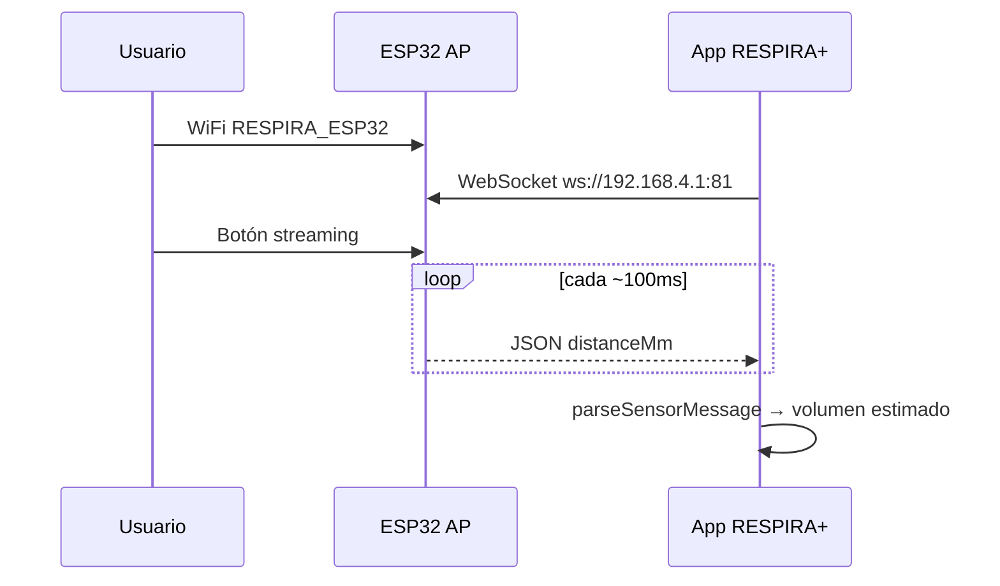

# RESPIRA+ — Auditoría de preparación: web touch + Supabase

**Fecha:** 7 de junio de 2026  
**Rama:** `audit/web-touch-supabase-readiness`  
**Tipo:** Solo documentación — sin cambios en runtime, código de app, sensor, ESP32, diseño, Supabase, `package.json` ni `.env`.  
**Objetivo:** Inventariar el estado actual y definir requisitos para migrar a **web_touch** (PWA/navegador con práctica táctil como input principal) con **Supabase** como almacenamiento cloud, **sin romper** el modo **local_sensor** (ESP32 + WiFi local).

---

## Resumen ejecutivo

| Dimensión | Estado actual | Objetivo web_touch |
|-----------|---------------|-------------------|
| Framework | Expo 54 · RN 0.81 · Expo Router 6 · TypeScript | Mismo bundle web (`expo start --web`) |
| Input principal | ESP32 WebSocket local (`distanceMm` → mL) | Práctica táctil (press/hold) |
| Persistencia | AsyncStorage local-first (`@rehab/*`) | Supabase + fallback local durante transición |
| Cloud | Congelado (`EXPO_PUBLIC_ENABLE_CLOUD_AUTH=false`) | Activar Supabase solo cuando esté listo |
| Evaluación inicial | Requiere sensor + calibración | Requiere adaptación para touch (no implementada aún) |
| Exportación | JSON/CSV v2.4.0; web ya tiene `triggerWebDownload` | Validar Safari iPhone |
| Notificaciones | `expo-notifications` nativo | Desactivar/aislar en web sin romper nativo |

**Principio rector:** Dos modos de despliegue coexisten por **feature flags** y **data mode**, no por bifurcar el repositorio.

---

## 1. Estado actual de RESPIRA+

### 1.1 Framework y stack

| Tecnología | Versión / uso |
|------------|---------------|
| **Expo** | ~54.0.35 |
| **React Native** | 0.81.5 |
| **React** | 19.1.0 |
| **Expo Router** | ~6.0.24 (file-based routing en `app/`) |
| **TypeScript** | Sí |
| **Persistencia local** | `@react-native-async-storage/async-storage` 2.2.0 |
| **Nube (opcional)** | `@supabase/supabase-js` 2.105.3 — congelada por defecto |
| **Sensor** | WebSocket nativo del navegador/RN hacia ESP32 AP |
| **Gráficos UI** | `react-native-svg`, tokens `wellness` |
| **Notificaciones** | `expo-notifications` (solo iOS/Android) |
| **Exportación** | `expo-file-system/legacy`, `expo-sharing` (nativo); Blob download (web) |

### 1.2 Estructura general

```
app-rehab-respiratoria/
├── app/                    # Rutas Expo Router (delgadas)
├── src/
│   ├── modules/            # Dominio por feature (device, session, patient, …)
│   ├── shared/             # UI, tema, utils
│   ├── lib/                # Supabase, cloud-data-store
│   └── docs/               # Notas técnicas internas
├── docs/                   # Documentación central
├── arduino_codes/          # Firmware ESP32
├── supabase/schema.sql     # Esquema prototipo existente
└── assets/                 # PDFs legales, imágenes
```

**Providers globales** (`app/_layout.tsx`): `ThemeProvider`, `AppModeProvider`, `SensorConnectionProvider`, `PatientSessionProvider`, `TouchPracticePreferenceProvider`, `LevelsProgressProvider`.

### 1.3 Pantallas principales

| Ruta | Pantalla | Función clínica |
|------|----------|-----------------|
| `/(tabs)/index` | `HomeScreen` | Dashboard, acceso terapia, export |
| `/(tabs)/terapia` | `LevelsScreen` | Selección de nivel, lanzamiento sesión |
| `/(tabs)/sesion` | `SessionScreen` | Sesión activa (tab oculta) |
| `/(tabs)/historial` | `HistoryScreen` | Adherencia, calendario, rachas |
| `/(tabs)/resumen` | `SummaryScreen` | Post-sesión (tab oculta) |
| `/profile` | `ProfileScreen` | Perfil, prefs touch, notificaciones |
| `/auth/local-profile` | Alta perfil local | Registro paciente local |
| `/legal/accept` | Consentimiento | Términos y condiciones |
| `/diagnostico` | `DiagnosticExamScreen` | Evaluación inicial (VIM) |
| `/diagnostico-resumen` | Resumen post-examen | — |
| `/sensor-connection` | `SensorConnectionScreen` | Conexión ESP32 |
| `/sensor-calibration` | `SensorCalibrationScreen` | Calibración (técnica si flag) |
| `/data-export` | `DataExportScreen` | Export JSON/CSV clínico |
| `/notification-settings` | Recordatorios | Solo nativo funcional |

### 1.4 Módulos técnicos

| Módulo | Archivos (~) | Responsabilidad |
|--------|:------------:|-----------------|
| `device/` | 69 | WebSocket ESP32, calibración, volumen, pantallas sensor |
| `session/` | 56 | Terapia, motor nivel 1, persistencia, touch vs sensor |
| `app-mode/` | 4 | Feature flags `EXPO_PUBLIC_*` |
| `export/` | 13 | Export JSON/CSV v2.4.0 |
| `notifications/` | 16 | Recordatorios locales |
| `auth/` | 13 | Login cloud (congelado) |
| `levels/` | 7 | UI Terapia, progreso niveles |
| `history/` | 3 | Agregados historial |
| `summary/` | 5 | Resumen post-sesión |
| `home/` | 2 | Dashboard |
| `onboarding/` | 3 | Modal bienvenida |
| `lib/` | — | `supabase.ts`, `cloud-data-store.ts` |

### 1.5 Módulos clínicos

| Módulo | Responsabilidad |
|--------|-----------------|
| `patient/` | Perfil local, prefs, contexto paciente, borrado |
| `diagnostics/` | Evaluación inicial, VIM, `patient_levels` |
| `legal/` | Consentimiento, guards, PDF |
| `session/` (reglas) | Validación intentos, unlock niveles, clasificación sesión |
| `clinician/` | Scaffold (sin rutas activas) |

**Alcance clínico:** Apoyo a ejercicios respiratorios postoperatorios. Estima **volumen inspirado** (mL), no presión. No diagnostica ni sustituye al profesional.

---

## 2. Modo `local_sensor`

Documentación del flujo actual con ESP32 — **no debe modificarse** durante la migración web.

### 2.1 Sensor y firmware

- **Hardware:** ESP32 + VL53L0X (ToF).
- **Firmware de referencia:** `arduino_codes/envio_datos_stream_button/envio_datos_stream_button.ino`.
- **Red:** AP `RESPIRA_ESP32` (password `respira123`), IP `192.168.4.1`.
- **Payload JSON:** `distanceMm`, `rawDistanceMm`, `distanceValid`. El ESP32 **no calcula volumen clínico**.
- **Gating hardware:** Streaming solo tras pulsar botón físico (GPIO26) con cliente WS conectado.

### 2.2 WebSocket / conexión WiFi local

| Parámetro | Valor |
|-----------|-------|
| URL WebSocket | `ws://192.168.4.1:81` |
| Cliente | `src/modules/device/websocket/esp32-websocket-client.ts` |
| Hook | `src/modules/device/adapters/use-esp32-websocket-sensor.ts` |
| Provider global | `src/modules/device/state/SensorConnectionProvider.tsx` |
| Parseo | `src/modules/device/ingestion/parse-sensor-message.ts` → `SensorReading` |
| Estados transporte | `idle`, `connecting`, `connected`, `receiving`, `error`, `disconnected` |
| Estados stream | `connected_waiting_stream`, `receiving_data`, `stream_paused` (2 s sin frames) |



### 2.3 Calibración

- **Perfil paciente activo:** RESPIRA+ 3000 mL (`cal-predefined-respira-3000-v20260602`).
- **Ecuación:** `Volumen (mL) = 28.66324925966009 × distanceMm − 523.8262554875091`, clamp 0–3000 mL.
- **Fuente:** `src/modules/device/calibration/predefined-calibration-models.ts`.
- **Instalación automática:** `predefined-calibration-service.ts` al primer uso.
- **Calibración técnica multi-punto:** Solo con `EXPO_PUBLIC_ENABLE_TECHNICAL_CALIBRATION=true`.
- **Storage:** `@respira_device_calibration_profiles_by_spirometer_v1`, `@respira_active_calibration_models_by_spirometer_v1`.

### 2.4 Conversión distancia → volumen

| Capa | Archivo |
|------|---------|
| Estimación activa | `active-volume-estimator.ts` |
| Orquestación | `volume-estimation-service.ts` |
| Hook en vivo | `use-active-volume-estimate.ts` |
| Sesión (throttle 120 ms) | `use-level-sensor-volume.ts` |
| Lectura viva | `sensor-live-reading.ts` (`checkSensorReadingLive`) |
| Readiness terapia | `therapy-readiness-service.ts`, `level-sensor-readiness.ts` |

### 2.5 Terapia con sensor real

1. Usuario lanza sesión desde Inicio/Terapia vía `useTherapySessionLauncher`.
2. `resolveTherapySessionLaunchInputMode` → `'sensor'` si transporte real conectado.
3. `evaluateLevelSensorReadiness` valida modelo activo + señal viva.
4. `SessionScreen` usa `useLevelSensorVolume` + `getInspirationNorm` desde lecturas reales.
5. Validación oficial: `session-attempt-validation-service.ts`, `evaluateSensorAttemptVolume`.
6. Al completar: `persistSessionResult` → unlock si sesión perfecta (no práctica).

### 2.6 Pantallas que dependen del sensor

| Pantalla / flujo | Dependencia |
|------------------|-------------|
| `/sensor-connection` | WebSocket, termómetro volumen |
| `/sensor-calibration` | Captura multi-punto (flag técnico) |
| `/diagnostico` | `useInitialEvaluationReadiness` exige sensor + calibración |
| `SessionScreen` (modo sensor) | `useLevelSensorVolume`, readiness gate |
| `HomeScreen` / `LevelsScreen` | Launch con readiness sensor |
| `/hardware-lab`, `/esp32-raw-test` | Debug/dev |

### 2.7 Archivos que NO deben romperse

**Críticos (conexión + parseo):**

- `src/modules/device/websocket/esp32-websocket-client.ts`
- `src/modules/device/adapters/use-esp32-websocket-sensor.ts`
- `src/modules/device/state/SensorConnectionProvider.tsx`
- `src/modules/device/ingestion/parse-sensor-message.ts`
- `src/modules/device/types/sensor-reading.ts`
- `src/modules/device/stream/sensor-stream-state.ts`
- `src/modules/device/sensor-real-connection.ts`

**Críticos (calibración + volumen):**

- `src/modules/device/calibration/predefined-calibration-models.ts`
- `src/modules/device/calibration/predefined-calibration-service.ts`
- `src/modules/device/calibration/active-volume-estimator.ts`
- `src/modules/device/calibration/calibration-storage.ts`
- `src/modules/device/calibration/active-calibration-storage.ts`
- `src/modules/device/volume-estimation/volume-estimation-service.ts`
- `src/modules/device/volume-estimation/therapy-readiness-service.ts`
- `src/modules/device/screens/SensorConnectionScreen.tsx`
- `src/modules/device/screens/SensorCalibrationScreen.tsx`

**Críticos (terapia sensor):**

- `src/modules/session/sensor/use-level-sensor-volume.ts`
- `src/modules/session/sensor/sensor-live-reading.ts`
- `src/modules/session/sensor/level-sensor-readiness.ts`
- `src/modules/session/sensor-evaluation/session-attempt-validation-service.ts`
- `src/modules/session/hooks/use-therapy-session-launcher.ts`
- `src/modules/session/hooks/resolve-therapy-session-launch.ts`

**Firmware de referencia:**

- `arduino_codes/envio_datos_stream_button/envio_datos_stream_button.ino`

---

## 3. Modo `touch_practice`

### 3.1 Archivos responsables

| Rol | Archivo |
|-----|---------|
| Flag de entorno | `src/modules/session/session-input-mode.ts` (`isTouchPracticeModeEnabled`) |
| Preferencia perfil | `src/modules/session/hooks/use-touch-practice-preference.tsx` |
| Gate efectivo | `src/modules/session/hooks/use-touch-practice-gate.ts` |
| Decisión launch | `src/modules/session/hooks/resolve-therapy-session-launch.ts` |
| Launcher compartido | `src/modules/session/hooks/use-therapy-session-launcher.ts` |
| Motor juego | `src/modules/session/engine/level-one/use-level-one-game.ts` |
| Adaptador touch | `src/modules/session/engine/touch/use-touch-input-adapter.ts` |
| Puerto respiratorio | `src/modules/session/engine/contracts/respiratory-input-port.ts` |
| Orquestación UI | `src/modules/session/screens/SessionScreen.tsx` |
| Clasificación | `src/modules/session/session-record-classification.ts` |
| Evaluación (ruta manual) | `src/modules/diagnostics/diagnostic-input-mode.ts` |
| Prefs storage | `src/modules/patient/storage/profile-preferences-repository.ts` |

### 3.2 Cómo simula inhalación

1. **Activación:** `EXPO_PUBLIC_ENABLE_TOUCH_PRACTICE_MODE=true` + preferencia `allowTouchPracticeInput` en Perfil + **sin** sensor real conectado (`isRealSensorTransportConnected` = false).
2. **Input UI:** `onPressIn` / `onPressOut` en área táctil de `SessionScreen` → `levelOneEngine.onInhaleStart` / `onInhaleEnd`.
3. **Motor:** `useLevelOneGame` inicia fase `inhaling`, incrementa `holdMs` cada 100 ms.
4. **Volumen simulado:** `simulatedVolumeForHold(targetVolume, holdMs)`:

   ```
   volumen = round(max(0, targetVolume × min(1.18, holdMs / 4500)))
   ```

   Ramp de 4,5 s hasta ~118 % del target (sin límite de fallo por tiempo en práctica).
5. **Normalización:** `computeInspirationNorm` usa `displayVolumeMl` simulado + `holdMs`.
6. **Validación:** No exige señal sensor viva; `isTouchPracticeSession` omite `evaluateSensorAttemptVolume`.

### 3.3 Conexión al motor de terapia

```
Touch UI (press/hold)
  → useLevelOneGame (onInhaleStart/End, holdMs, fases)
  → getInspirationNorm (volumen simulado)
  → resolveOfficialAttemptOnRelease (simulatedAtRelease)
  → buildOfficialValidationFromLevelOneRelease
  → persistSessionResult (is_practice_session: true, sin unlock)
```

`SessionInputMode = 'touch_practice'` → `data_source: 'touch_simulation'`, `is_practice_session: true`.

### 3.4 Requisitos para usarlo como fuente principal en `web_touch`

| Requisito | Estado actual | Acción futura |
|-----------|---------------|---------------|
| Flag global touch | `EXPO_PUBLIC_ENABLE_TOUCH_PRACTICE_MODE` | `true` en build web_touch |
| Sensor deshabilitado en web | No hay flag explícito; WS fallará sin AP | `EXPO_PUBLIC_ENABLE_SENSOR=false` + no montar rutas sensor |
| Preferencia touch auto-activa | Requiere toggle manual en Perfil | Default `allowTouchPracticeInput=true` en web_touch |
| Evaluación inicial sin sensor | **Bloqueada** — `useInitialEvaluationReadiness` exige sensor | Adaptar readiness para touch en web |
| Unlock de niveles | Touch no desbloquea (`persistSessionResult` early return) | Decidir política clínica web (¿touch cuenta como oficial?) |
| Lanzamiento sesión | `resolveTherapySessionLaunchInputMode` prioriza sensor | En web: forzar `touch_practice` cuando sensor disabled |
| Clasificación historial | Etiqueta «Práctica sin sensor» | Mantener o redefinir para web oficial |
| Persistencia | AsyncStorage local | Migrar a Supabase |

**Decisión pendiente (clínica):** En `web_touch`, ¿las sesiones touch pasan a ser **oficiales** (con unlock) o siguen siendo **práctica**? Hoy el código las trata como práctica sin progresión.

---

## 4. `web_touch` futuro

### 4.1 Principios

1. **No intentar conectar ESP32** en navegador — imposible unirse al AP local desde PWA remota sin configuración especial; WebSocket a `192.168.4.1` no es viable en despliegue cloud.
2. **Touch practice como input principal** — press/hold sustituye al pistón físico.
3. **Mantener flujos clínicos de producto:** perfil, términos, evaluación, terapia, resumen, historial, resultados, exportación.
4. **Supabase como almacenamiento cloud** — reemplazo progresivo de AsyncStorage para datos de paciente.
5. **No compartir con usuarios** hasta que Supabase funcione end-to-end con RLS real.

### 4.2 Flujos a preservar en web

| Flujo | Adaptación web |
|-------|----------------|
| Perfil / alta paciente | Local → Supabase; sin clave PAC hardware |
| Términos / consentimiento | `consent_records` en Supabase |
| Evaluación inicial | Touch input; sin readiness sensor |
| Terapia / sesión | Touch only; ocultar rutas sensor |
| Resumen post-sesión | Igual; leer de Supabase |
| Historial | Igual; agregados desde cloud |
| Exportación | `triggerWebDownload` ya implementado |
| Notificaciones | Mostrar «Solo en app»; no programar |

### 4.3 Rutas a ocultar o desactivar en web_touch

- `/sensor-connection`
- `/sensor-calibration`
- `/hardware-lab`
- `/esp32-raw-test`
- Enlaces debug sensor en Historial/Resumen (flag `EXPO_PUBLIC_ENABLE_SENSOR_DEBUG`)

### 4.4 Arquitectura objetivo

```
Navegador (Safari/Chrome)
  → Expo web bundle
  → TouchPractice (input)
  → Session engine (sin cambios clínicos)
  → Data layer (abstracción local | supabase)
  → Supabase (patients, sessions, consent, …)
```

---

## 5. Almacenamiento actual

### 5.1 Pacientes

| Aspecto | Detalle |
|---------|---------|
| **Dónde** | AsyncStorage `@rehab/patients_v1` |
| **Repositorio** | `src/modules/patient/patient-repository.ts` |
| **Servicio** | `src/modules/patient/patient-service.ts` |
| **Paciente activo** | `@rehab/current_patient_clave_v1` |
| **IDs** | `@rehab/patient_id_sequence_v1` (monotónico) |
| **Cloud** | `createPatientLocal` explícitamente **no** usa Supabase |

### 5.2 Evaluaciones (diagnóstico inicial)

| Aspecto | Detalle |
|---------|---------|
| **Dónde** | `@rehab/diagnostics_v1` |
| **Servicio** | `src/modules/diagnostics/diagnostic-service.ts` |
| **Repositorio** | `src/modules/diagnostics/diagnostic-repository.ts` |
| **Campos clave** | `max_inspiratory_volume` (VIM), `attempts[]`, `consistency_summary` |
| **Niveles generados** | `@rehab/patient_levels_v1` vía `generatePatientLevels` |

### 5.3 Sesiones

| Aspecto | Detalle |
|---------|---------|
| **Dónde** | `@rehab/sessions_v1` |
| **Repositorio** | `src/modules/session/storage/session-progress-repository.ts` |
| **Servicio** | `src/modules/session/session-progress-service.ts` |
| **Campos** | `input_mode`, `data_source`, `is_practice_session`, métricas volumen, trazabilidad cal/sensor |

### 5.4 Intentos

| Aspecto | Detalle |
|---------|---------|
| **Dónde** | `@rehab/attempts_v1` |
| **Campos** | `hold_ms`, `peak_volume`, `valid`, `sensor_estimated_volume_ml`, `distance_mm`, etc. |

### 5.5 Historial

| Aspecto | Detalle |
|---------|---------|
| **Fuente** | Lectura de `@rehab/sessions_v1` + `@rehab/attempts_v1` |
| **Agregados** | `src/modules/history/history-aggregates.ts` |
| **Progreso niveles** | `rehab.levels.progress.v1.u{patientId}` |
| **Racha** | Campo `racha_actual` en `PatientRecord` + `updateDailyProgress` |

### 5.6 Términos aceptados

| Aspecto | Detalle |
|---------|---------|
| **Dónde (local)** | `@rehab/legal_consent_v1` (`LEGAL_STORAGE_KEY` en `src/modules/legal/constants.ts`) |
| **Servicio** | `src/modules/legal/consent-service.ts` |
| **Cloud (si auth)** | Tabla `consent_records` vía Supabase cuando `isCloudAuthEnabled()` |
| **Guards** | `ConsentTabGuard`, `ConsentStackGuard`, gate en `app/index.tsx` |

### 5.7 Dependencias de APIs nativas / plataforma

| API | Uso | Web |
|-----|-----|-----|
| **AsyncStorage** | Toda persistencia clínica local | Funciona vía `@react-native-async-storage` en web (localStorage) |
| **expo-file-system** | Export nativo (write + share) | No usado en web; fallback Blob download |
| **expo-sharing** | Share sheet iOS/Android | No disponible en web |
| **expo-notifications** | Recordatorios | No soportado; `supportsNativeLocalNotifications()` = false |
| **SecureStore** | No usado en flujo clínico actual | — |
| **WebSocket** | ESP32 sensor | Disponible en web pero inútil sin AP local |

### 5.8 Claves de dispositivo (no borrar con paciente)

Prefijo `@respira_*`: calibración, espirómetro activo. **Intencionalmente no se borran** al eliminar perfil paciente (`patient-delete-service.ts`).

---

## 6. Exportación

### 6.1 Formatos

| Formato | Versión | Archivo generador |
|---------|---------|-------------------|
| **JSON clínico** | 2.4.0 / schema 1.0.0 | `clinical-json-exporter.ts` |
| **CSV clínico** | 2.4.0 | `clinical-csv-exporter.ts` |
| **CSV técnico calibración** | 2.4.0 | `calibration-technical-csv-exporter.ts` (solo flag técnico) |

### 6.2 Archivos responsables

| Rol | Ruta |
|-----|------|
| Pantalla | `src/modules/export/screens/DataExportScreen.tsx` |
| Ruta | `app/data-export.tsx` |
| Agregador | `src/modules/export/services/clinical-export-service.ts` |
| Bundle paciente | `src/modules/export/services/patient-clinical-export-service.ts` |
| Sesiones | `src/modules/export/services/session-export-service.ts` |
| Descarga | `src/modules/export/utils/download-export-file.ts` |
| Tipos | `src/modules/export/types/export-record.ts` |

### 6.3 Flujo

1. `getClinicalExportSnapshot(patientId)` lee AsyncStorage (patient, diagnostics, levels, sessions, attempts, cal opcional).
2. Serializa JSON o CSV.
3. `downloadExportFile`:
   - **Web:** `triggerWebDownload` (Blob + anchor click) — ya implementado.
   - **Nativo:** `FileSystem.writeAsStringAsync` + `Sharing.shareAsync`.

### 6.4 Dependencias que podrían fallar en web

| Dependencia | Riesgo | Mitigación actual |
|-------------|--------|-------------------|
| `expo-file-system` | No usado en web | Rama `Platform.OS === 'web'` |
| `expo-sharing` | No disponible | Evitado en web |
| `Alert.alert` | Comportamiento variable | Usado para errores |
| Blob / download | Safari iOS restricciones | **Probar en Fase 7** |
| Lectura AsyncStorage | Datos en localStorage del navegador | OK para preview local |
| Bloque calibración | Depende de `@respira_*` | En web_touch puede estar vacío |

### 6.5 Adaptaciones necesarias para web_touch

1. Export debe leer de **Supabase** cuando `EXPO_PUBLIC_DATA_MODE=supabase`.
2. Validar nombres CSV (`respira_reporte_clinico_CLAVE_timestamp.csv`) en Safari.
3. Consent gate antes de export — mantener `isConsentActive()`.
4. CSV técnico calibración: **no ofrecer** en web_touch (sin sensor).
5. Considerar export async si snapshot cloud es lento.

---

## 7. Notificaciones

### 7.1 Archivos responsables

| Rol | Ruta |
|-----|------|
| Pantalla | `src/modules/notifications/screens/NotificationSettingsScreen.tsx` |
| Hook | `src/modules/notifications/use-notification-settings.ts` |
| Scheduler | `src/modules/notifications/notification-scheduler.ts` |
| Permisos | `src/modules/notifications/notification-permissions.ts` |
| Storage | `src/modules/notifications/notification-settings.storage.ts` |
| Copy / web label | `src/modules/notifications/notification-copy.ts` |
| Ruta | `app/notification-settings.tsx` |
| Sync Perfil | `ProfileScreen.tsx` → `readNotificationSettingsForDisplay` |

### 7.2 Dependencias nativas

- `expo-notifications` — scheduling, permisos, canales Android.
- `supportsNativeLocalNotifications()` → solo `ios` | `android`.
- En web: `scheduleDailyReminders` lanza error explícito; UI muestra **«Solo en app»**.

### 7.3 Aislamiento en web_touch sin romper local_sensor

| Estrategia | Implementación sugerida |
|------------|-------------------------|
| Guard de plataforma | Mantener `supportsNativeLocalNotifications()` como única compuerta |
| No importar side-effects | Evitar `Notifications.setNotificationHandler` en web bundle |
| UI degradada | Perfil y `/notification-settings` muestran copy «Solo en app» |
| Storage | Seguir guardando prefs en AsyncStorage (no rompe nativo) |
| Flag opcional | `EXPO_PUBLIC_ENABLE_NOTIFICATIONS=false` en web_touch (futuro) |
| local_sensor nativo | Sin cambios — scheduler sigue funcionando en iOS/Android |

**Regla:** Nunca eliminar el módulo `notifications/`; solo no invocar scheduling en web.

---

## 8. Supabase nuevo — estructura inicial propuesta

Parte del esquema existente en `supabase/schema.sql` (prototipo con RLS abierta). Propuesta alineada con tipos actuales de la app y nombres solicitados.

### 8.1 `patients`

| Campo | Tipo | Origen app |
|-------|------|------------|
| `patient_id` | `bigint` PK | `PatientRecord.paciente_id` |
| `unique_code` | `text` UNIQUE | `PatientRecord.clave` (PAC###) |
| `name` | `text` | `nombre_completo` |
| `age` | `int` | `edad` |
| `registration_date` | `timestamptz` | `fecha_creacion` |
| `current_level_id` | `text` FK → levels | `current_level_id` |
| `status` | `text` | `'active'` / `'deleted'` |
| `streak_count` | `int` | `racha_actual` |
| `last_completed_date` | `date` | `ultima_fecha_cumplida` |
| `created_at` | `timestamptz` | auto |
| `updated_at` | `timestamptz` | auto |

### 8.2 `patient_profiles`

Extensión de prefs no clínicas (touch, UI).

| Campo | Tipo | Origen app |
|-------|------|------------|
| `profile_id` | `bigint` PK | generado |
| `patient_id` | `bigint` FK | `paciente_id` |
| `allow_touch_practice_input` | `boolean` | `profile-preferences-repository` |
| `preferred_input_mode` | `text` | `'touch_practice'` en web_touch |
| `locale` | `text` | futuro |
| `updated_at` | `timestamptz` | auto |

### 8.3 `consent_acceptances`

Reemplaza/evoluciona `consent_records` del schema actual.

| Campo | Tipo | Origen app |
|-------|------|------------|
| `consent_id` | `bigint` PK | generado |
| `patient_id` | `bigint` FK | paciente activo |
| `document_version` | `text` | `LEGAL_DOCUMENT_VERSION` |
| `document_title` | `text` | `LEGAL_DOCUMENT_TITLE` |
| `accepted_at` | `timestamptz` | `acceptedAt` |
| `withdrawn_at` | `timestamptz` | retiro |
| `consent_status` | `text` | `active` / `withdrawn` |
| `accepted_terms` | `boolean` | flags individuales |
| `accepted_consent` | `boolean` | — |
| `accepted_privacy` | `boolean` | — |
| `accepted_clinical_disclaimer` | `boolean` | — |
| `accepted_support_indicators_disclaimer` | `boolean` | — |
| `accepted_statements` | `jsonb` | array IDs |
| `acceptance_method` | `text` | `'digital_in_app'` |
| `app_version` | `text` | Expo config |

### 8.4 `baseline_evaluations`

Equivalente a `diagnostics` / evaluación inicial.

| Campo | Tipo | Origen app |
|-------|------|------------|
| `evaluation_id` | `bigint` PK | `diagnostic_id` |
| `patient_id` | `bigint` FK | — |
| `evaluation_number` | `int` | `diagnostic_number` |
| `evaluation_date` | `timestamptz` | `diagnostic_date` |
| `max_inspiratory_volume` | `int` | VIM (mL estimados) |
| `input_mode` | `text` | `sensor` / `touch_practice` |
| `attempts_json` | `jsonb` | `DiagnosticRecord.attempts` |
| `consistency_summary` | `jsonb` | resumen consistencia |
| `created_at` | `timestamptz` | auto |

### 8.5 `therapy_sessions`

| Campo | Tipo | Origen app |
|-------|------|------------|
| `session_id` | `bigint` PK | `SessionRecord.session_id` |
| `patient_id` | `bigint` FK | — |
| `patient_level_id` | `bigint` FK | — |
| `level_id` | `text` FK | — |
| `session_date` | `timestamptz` | — |
| `session_number` | `int` | — |
| `total_attempts` | `int` | — |
| `valid_attempts` | `int` | — |
| `invalid_attempts` | `int` | — |
| `compliance_percent` | `int` | — |
| `max_volume` | `int` | estimado o simulado |
| `avg_volume` | `int` | — |
| `avg_hold_seconds` | `numeric` | — |
| `completed` | `boolean` | — |
| `perfect` | `boolean` | — |
| `interrupted` | `boolean` | — |
| `input_mode` | `text` | `sensor` / `touch_practice` |
| `data_source` | `text` | `sensor_model` / `touch_simulation` |
| `is_practice_session` | `boolean` | — |
| `calibration_profile_id` | `text` | nullable (web null) |
| `active_model_id` | `text` | nullable |
| `spirometer_device_id` | `text` | nullable |
| `firmware_version` | `text` | nullable |
| `created_at` | `timestamptz` | auto |

### 8.6 `therapy_attempts`

| Campo | Tipo | Origen app |
|-------|------|------------|
| `attempt_id` | `bigint` PK | — |
| `session_id` | `bigint` FK | — |
| `attempt_number` | `int` | — |
| `hold_ms` | `int` | — |
| `peak_volume` | `int` | — |
| `valid` | `boolean` | — |
| `sensor_estimated_volume_ml` | `int` | nullable en touch |
| `distance_mm` | `numeric` | nullable en touch |
| `raw_distance_mm` | `numeric` | nullable |
| `sensor_attempt_status` | `text` | nullable |
| `attempt_timestamp` | `timestamptz` | — |
| `created_at` | `timestamptz` | auto |

### 8.7 `therapy_results`

Agregados post-sesión / progreso (complementa `patient_levels` + `daily_progress`).

| Campo | Tipo | Origen app |
|-------|------|------------|
| `result_id` | `bigint` PK | generado |
| `patient_id` | `bigint` FK | — |
| `patient_level_id` | `bigint` FK | — |
| `level_id` | `text` | — |
| `sessions_completed` | `int` | `PatientLevelRecord` |
| `perfect_sessions_completed` | `int` | — |
| `level_status` | `text` | `locked` / `active` / `completed` |
| `target_volume` | `int` | — |
| `last_session_date` | `timestamptz` | — |
| `streak_count` | `int` | racha |
| `updated_at` | `timestamptz` | auto |

### 8.8 `export_logs`

Trazabilidad de exportaciones (auditoría).

| Campo | Tipo | Origen app |
|-------|------|------------|
| `export_id` | `bigint` PK | generado |
| `patient_id` | `bigint` FK | — |
| `exported_at` | `timestamptz` | timestamp export |
| `export_format` | `text` | `json` / `csv` |
| `export_version` | `text` | `2.4.0` |
| `session_count` | `int` | resumen |
| `platform` | `text` | `web` / `ios` / `android` |
| `created_at` | `timestamptz` | auto |

### 8.9 `app_settings`

Configuración por paciente o global.

| Campo | Tipo | Origen app |
|-------|------|------------|
| `setting_id` | `bigint` PK | generado |
| `patient_id` | `bigint` FK nullable | null = global |
| `key` | `text` | ej. `onboarding_seen` |
| `value` | `jsonb` | — |
| `updated_at` | `timestamptz` | auto |

### 8.10 Relaciones

```
patients 1──* patient_profiles
patients 1──* consent_acceptances
patients 1──* baseline_evaluations
patients 1──* therapy_sessions
patients 1──* therapy_results
patients 1──* export_logs
patients 1──* app_settings
therapy_sessions 1──* therapy_attempts
baseline_evaluations 1──* therapy_results (vía patient_levels / diagnostic_id)
levels (catálogo) ←── therapy_sessions.level_id
```

### 8.11 Seguridad (obligatorio antes de usuarios reales)

- **Eliminar** políticas «Prototype open access» de `supabase/schema.sql`.
- **RLS real** por `patient_id` o auth user.
- **Nunca** `service_role` en cliente.
- Ver `docs/supabase-security-notes.md`.

---

## 9. Variables de entorno propuestas

### 9.1 Definiciones

| Variable | Propósito |
|----------|-----------|
| `EXPO_PUBLIC_APP_ENV` | Identificador de entorno: `local_sensor` \| `web_touch` \| `staging` |
| `EXPO_PUBLIC_ENABLE_SENSOR` | Habilita rutas, providers y UI de ESP32 |
| `EXPO_PUBLIC_ENABLE_TOUCH_PRACTICE` | Habilita modo práctica táctil (reemplaza/en complementa `EXPO_PUBLIC_ENABLE_TOUCH_PRACTICE_MODE`) |
| `EXPO_PUBLIC_ENABLE_SUPABASE` | Habilita cliente Supabase y repositorios cloud |
| `EXPO_PUBLIC_DATA_MODE` | `local` \| `supabase` \| `hybrid` — fuente de verdad de datos |
| `EXPO_PUBLIC_SUPABASE_URL` | URL proyecto Supabase |
| `EXPO_PUBLIC_SUPABASE_ANON_KEY` | Clave anónima pública (solo cliente) |

**Compatibilidad:** Mantener variables existentes durante transición:

- `EXPO_PUBLIC_ENABLE_CLOUD_AUTH` → alias lógico de auth+supabase legacy
- `EXPO_PUBLIC_ENABLE_TOUCH_PRACTICE_MODE` → alias de `EXPO_PUBLIC_ENABLE_TOUCH_PRACTICE`

### 9.2 Configuración `local_sensor`

```env
EXPO_PUBLIC_APP_ENV=local_sensor
EXPO_PUBLIC_ENABLE_SENSOR=true
EXPO_PUBLIC_ENABLE_TOUCH_PRACTICE=false
EXPO_PUBLIC_ENABLE_SUPABASE=false
EXPO_PUBLIC_DATA_MODE=local
EXPO_PUBLIC_ENABLE_CLOUD_AUTH=false
EXPO_PUBLIC_ENABLE_TOUCH_PRACTICE_MODE=false
EXPO_PUBLIC_ENABLE_TECHNICAL_CALIBRATION=false
EXPO_PUBLIC_ENABLE_SENSOR_DEBUG=false
# EXPO_PUBLIC_SUPABASE_URL=        # vacío o omitido
# EXPO_PUBLIC_SUPABASE_ANON_KEY=   # vacío o omitido
```

**Comportamiento esperado:**

- ESP32 WebSocket operativo.
- Terapia y evaluación con sensor.
- AsyncStorage como única persistencia clínica.
- Sin dependencia de internet para flujo principal.

### 9.3 Configuración `web_touch`

```env
EXPO_PUBLIC_APP_ENV=web_touch
EXPO_PUBLIC_ENABLE_SENSOR=false
EXPO_PUBLIC_ENABLE_TOUCH_PRACTICE=true
EXPO_PUBLIC_ENABLE_SUPABASE=true
EXPO_PUBLIC_DATA_MODE=supabase
EXPO_PUBLIC_ENABLE_CLOUD_AUTH=false
EXPO_PUBLIC_ENABLE_TOUCH_PRACTICE_MODE=true
EXPO_PUBLIC_ENABLE_TECHNICAL_CALIBRATION=false
EXPO_PUBLIC_ENABLE_SENSOR_DEBUG=false
EXPO_PUBLIC_SUPABASE_URL=https://YOUR_PROJECT.supabase.co
EXPO_PUBLIC_SUPABASE_ANON_KEY=YOUR_SUPABASE_ANON_KEY
```

**Comportamiento esperado:**

- Sin rutas ni readiness de ESP32.
- Touch practice como input por defecto.
- Datos en Supabase (con fallback local solo en dev/hybrid).
- Export vía download web.
- Notificaciones degradadas («Solo en app»).
- **No compartir URL pública** hasta QA + RLS completos.

---

## 10. Riesgos

### 10.1 Prioritarios (tabla)

| # | Riesgo | Impacto | Mitigación |
|---|--------|---------|------------|
| 1 | Romper conexión sensor | Terapia y evaluación inutilizables en campo | No tocar `device/websocket`, `SensorConnectionProvider`; flag `ENABLE_SENSOR` |
| 2 | Romper calibración | Volumen estimado incorrecto | No modificar `predefined-calibration-models.ts` ni storage `@respira_*` |
| 3 | Romper terapia | Pérdida de datos, unlock erróneo | Tests regresión `SessionScreen`, `persistSessionResult`; no cambiar reglas clínicas |
| 4 | Romper historial | Adherencia y rachas incorrectas | Migración dual-write; validar agregados |
| 5 | Romper exportación | Sin datos para profesional | Probar JSON/CSV web; mantener schema 2.4.0 |
| 6 | Exponer llaves privadas | Brecha de seguridad | Solo `anon_key` en cliente; `.env` fuera de Git |
| 7 | Datos sensibles sin control | Incumplimiento ético/legal | RLS real, consentimiento, no prototipo abierto |
| 8 | APIs nativas en web | Crashes o UX rota | Guards `Platform.OS`, `supportsNativeLocalNotifications` |

### 10.2 Riesgos específicos local_sensor

- Refactor accidental de `useTherapySessionLauncher` que elimine rama sensor.
- Unificar data layer y romper escritura AsyncStorage sincrónica.
- Cambiar `resolveTherapySessionLaunchInputMode` para priorizar touch en builds nativas.
- Borrar claves `@respira_*` al migrar storage.
- Activar Supabase obligatorio y bloquear app sin internet en campo ESP32.

### 10.3 Riesgos específicos web_touch

- Evaluación inicial bloqueada (readiness sensor hardcoded).
- Sesiones touch no desbloquean niveles — producto incompleto.
- AsyncStorage en web (localStorage) no sincroniza entre dispositivos.
- Safari iOS: download export, touch events, viewport.
- Supabase prototipo con RLS abierta expuesta en preview URL.
- Mezclar sesiones touch simuladas con métricas clínicas «oficiales» sin etiquetado.

---

## 11. Plan recomendado por fases

| Fase | Nombre | Entregables | Dependencias |
|:----:|--------|-------------|--------------|
| **1** | Auditoría | Este documento | — |
| **2** | Feature flags | `EXPO_PUBLIC_APP_ENV`, `ENABLE_SENSOR`, `ENABLE_TOUCH_PRACTICE`, `DATA_MODE` en `app-mode-config.ts` | Fase 1 |
| **3** | Proteger sensor local | Tests regresión sensor; builds `local_sensor` sin cambios de comportamiento | Fase 2 |
| **4** | Habilitar web touch local | `expo start --web` con touch only; ocultar rutas sensor; evaluación touch | Fase 2 |
| **5** | Crear Supabase | Tablas §8, RLS draft, migraciones SQL | Fase 1 |
| **6** | Conectar Supabase | Capa repositorio dual/local; sync consent, patient, sessions | Fases 4–5 |
| **7** | Probar Safari iPhone | Export, touch, scroll, tabs, localStorage | Fase 4–6 |
| **8** | Desplegar preview | EAS / hosting estático; env `web_touch`; **sin usuarios** | Fase 7 |
| **9** | Compartir con usuarios | RLS producción, consentimiento legal, monitoreo | Fase 8 + checklist §12 |

---

## 12. Checklist previo a migración

### 12.1 Inventario y baseline

- [ ] Rama `audit/web-touch-supabase-readiness` mergeada o referenciada.
- [ ] Build `local_sensor` actual pasa QA manual sensor (conexión, calibración, terapia, historial).
- [ ] Build web actual arranca sin crash (`npx expo start --web`).
- [ ] Documentar versión Expo/RN vigente.

### 12.2 Feature flags y configuración

- [ ] Definir matriz env §9 (local_sensor vs web_touch).
- [ ] `.env.example` actualizado con nuevas variables (sin valores reales).
- [ ] Builds separados o perfiles EAS para cada modo.
- [ ] `app-mode-config.ts` lee nuevos flags sin romper `isCloudAuthEnabled()`.

### 12.3 Protección local_sensor

- [ ] Lista de archivos §2.7 en checklist de PR (no modificar sin revisión).
- [ ] Test: ESP32 AP → WS → volumen en vivo → terapia → historial.
- [ ] Test: evaluación inicial con sensor completa VIM + niveles.
- [ ] Test: touch desactivado en build local_sensor.
- [ ] Test: calibración predefinida 3000 mL intacta.

### 12.4 Web touch funcional (sin Supabase)

- [ ] `ENABLE_SENSOR=false` oculta rutas sensor.
- [ ] Touch practice lanza sesión y completa 10 intentos.
- [ ] Resumen e historial muestran sesión (clasificación correcta).
- [ ] Export JSON/CSV descarga en Chrome desktop.
- [ ] Perfil: toggle touch / copy correcto.
- [ ] Notificaciones: «Solo en app» sin error en consola.
- [ ] Consentimiento: flujo completo en web.

### 12.5 Supabase

- [ ] Tablas §8 creadas en proyecto dev.
- [ ] RLS **no** es «open access» antes de preview.
- [ ] Políticas filtran por `patient_id`.
- [ ] Solo `anon_key` en cliente.
- [ ] `.env` real no commiteado.
- [ ] Rotación de claves si hubo exposición previa.

### 12.6 Integración datos

- [ ] Alta paciente → `patients` + `patient_profiles`.
- [ ] Consent → `consent_acceptances`.
- [ ] Evaluación → `baseline_evaluations` + niveles.
- [ ] Sesión → `therapy_sessions` + `therapy_attempts`.
- [ ] Historial lee desde Supabase en `DATA_MODE=supabase`.
- [ ] Export lee snapshot cloud.
- [ ] Migración opcional AsyncStorage → Supabase (una vez).

### 12.7 Safari iPhone y preview

- [ ] Touch press/hold responsivo en Safari iOS.
- [ ] Export download en Safari (fallback si falla).
- [ ] Tabs y navegación Expo Router estable.
- [ ] Viewport / safe area correctos.
- [ ] Preview URL con auth básica o no indexada.
- [ ] **No** compartir link a usuarios finales hasta ítems anteriores OK.

### 12.8 Clínico y legal

- [ ] Copy «volumen estimado» / «práctica sin sensor» visible.
- [ ] Consentimiento activo antes de datos clínicos.
- [ ] Export etiquetado v2.4.0.
- [ ] Decisión documentada: touch web ¿oficial o práctica?

---

## 13. Cambios que NO deben hacerse todavía

Los siguientes ítems están **explícitamente prohibidos** en esta fase de preparación:

| # | Prohibición | Razón |
|---|-------------|-------|
| 1 | **No conectar sensor a web** | AP local incompatible con PWA remota |
| 2 | **No compartir link a usuarios** | Supabase y RLS no listos |
| 3 | **No borrar almacenamiento local** | local_sensor depende de AsyncStorage |
| 4 | **No eliminar modo sensor** | Prototipo hardware activo |
| 5 | **No modificar calibración** | Modelo 3000 mL validado |
| 6 | **No cambiar lógica clínica** | Validación intentos, unlock, VIM |
| 7 | **No agregar tarjeta de instalación aún** | PWA install prompt prematuro |
| 8 | **No conectar Supabase en producción** | Solo documentar y planificar |
| 9 | **No cambiar `package.json`** | Sin nuevas dependencias sin acuerdo |
| 10 | **No cambiar `.env` commiteado** | Secretos fuera de Git |
| 11 | **No eliminar módulo notifications** | Nativo lo necesita |
| 12 | **No unificar touch como oficial** | Requiere decisión clínica explícita |

---

## Referencias consultadas

| Documento | Uso en esta auditoría |
|-----------|---------------------|
| `docs/AUDITORIA-TECNICA-SENSOR-ESP32.md` | Flujo ESP32, archivos críticos |
| `docs/supabase-security-notes.md` | Riesgos cloud, variables |
| `docs/06-data-and-storage/*` | Claves, modelos, export schema |
| `docs/04-device-and-sensor/*` | Protocolo WS, firmware |
| `docs/05-calibration/*` | Modelo 3000 mL |
| `docs/10-testing-and-validation/regression-risk-map.md` | Áreas de riesgo |
| `docs/00-overview/README.md` | Estado madurez |
| `docs/01-app-architecture/README.md` | Módulos, rutas, providers |
| `README.md` | Stack, funcionalidades |
| `README_CLOUD_FREEZE.md` | Congelación cloud |
| `supabase/schema.sql` | Esquema prototipo existente |
| `src/modules/app-mode/README.md` | Flags actuales |
| `src/modules/session/README.md` | Touch vs sensor |

---

## Control de cambios

| Versión | Fecha | Autor | Notas |
|---------|-------|-------|-------|
| 1.0.0 | 2026-06-07 | Auditoría Cursor | Creación inicial en rama `audit/web-touch-supabase-readiness` |
