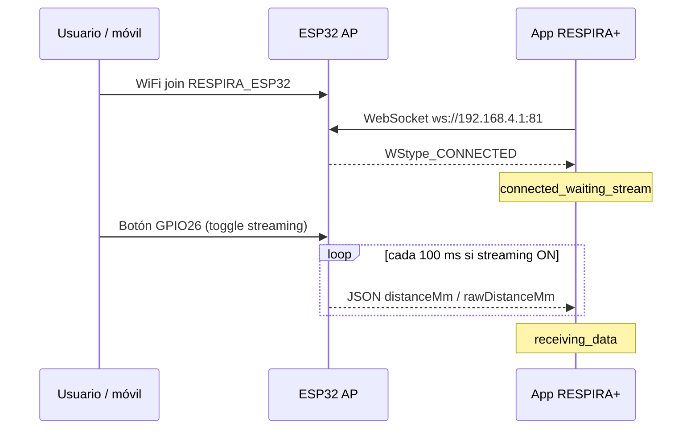
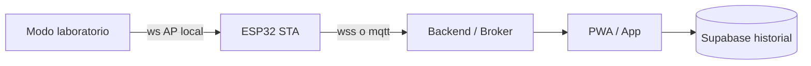

# RESPIRA+ — Auditoría técnica: sensor, ESP32, WebSocket y calibración

> **Nota de contexto temporal (junio 2026):** este informe corresponde a la auditoría del **28 de mayo de 2026**. Se conserva íntegro como registro histórico. El **modelo canónico vigente** para el flujo paciente es la calibración de banco del **2 de junio de 2026** (espirómetro 3000 mL; R² = 0,992; MAE = 65,36 mL). Las métricas citadas más abajo como «curva histórica de presentación» (R² = 0,9962; MAE = 41 mL) **no están instaladas** en la app actual. Reconciliación: [09-academic-validation/README.md](./09-academic-validation/README.md), [05-calibration/README.md](./05-calibration/README.md).

**Fecha:** 28 de mayo de 2026  
**Alcance:** Conexión ESP32–app, WebSocket local, ingestión JSON, estado del sensor, calibración mm→mL, almacenamiento, exportación, preparación para arquitectura online y deuda técnica.  
**Firmware auditado (única referencia):** `arduino_codes/envio_datos_stream_button/envio_datos_stream_button.ino`  
**Tipo:** Solo lectura — sin cambios en código en el momento de esta auditoría.

---

## Contexto clínico y técnico

RESPIRA+ es una aplicación para apoyar **ejercicios respiratorios postoperatorios** con espirómetro incentivador volumétrico. Un sensor **ToF VL53L0X** montado en un **ESP32** estima el desplazamiento del pistón; la app convierte esa distancia en **volumen inspirado estimado (mL)** mediante calibración local por espirómetro físico.

**El sistema NO mide presión inspiratoria, NO diagnostica función pulmonar y NO sustituye al profesional de salud.**

Hoy la comunicación es **local por WiFi (AP del ESP32) y WebSocket**. La arquitectura debe prepararse para un entorno **online** (PWA/web + ESP32 en red con internet + backend o broker).

**Curva histórica de presentación (mayo 2026 — no usada en código ni como modelo canónico actual):**

```
V(mL) = 52.95 × distancia(mm) − 2251.97
R² = 0.9962, MAE = 41 mL
```

**Hallazgo (mayo 2026):** Esa ecuación **no estaba hardcodeada** en el momento de la auditoría. El volumen en terapia sale del **modelo activo** (`linear_regression` o `piecewise_linear`) derivado de la calibración en la app.

**Actualización (jun 2026):** el flujo paciente usa el modelo lineal predefinido de banco `cal-predefined-respira-3000-v20260602` (R² = 0,992; MAE = 65,36 mL). Las cifras de la curva anterior corresponden a una **sesión o versión anterior** de trabajo del equipo, no al estado canónico documentado en [README-csv-tecnico-calibracion.md](./calibration/README-csv-tecnico-calibracion.md).

**Otros firmwares `.ino` en el repositorio:** Solo se mencionan cuando generan confusión o duplicación. **No** son fuente principal de esta auditoría.

---

## A. Resumen ejecutivo

1. **Conexión actual:** El ESP32 crea un **Access Point** (`RESPIRA_ESP32`, IP `192.168.4.1`). La app se conecta por **WebSocket** a `ws://192.168.4.1:81` mediante un cliente global (`SensorConnectionProvider`).

2. **Gating de datos en hardware:** El firmware **no envía JSON** hasta que (a) hay al menos un cliente WebSocket y (b) el usuario **activa streaming con el botón físico** (GPIO26). El LED azul (GPIO27) indica espera vs transmisión.

3. **Payload del firmware:** Envía `distanceMm`, `rawDistanceMm` y `distanceValid`. Los campos `volumeMl`, `flowState`, `sustainedTimeMs`, `validRepetitions`, `isValidAttempt` van en **valores por defecto/cero** — el volumen clínico **no se calcula en el ESP32**.

4. **Parser en app:** `parseSensorMessage` normaliza el JSON a `SensorReading`; tolera campos faltantes y rellena `volumeMl` con 0 si no viene.

5. **Volumen en app:** La conversión mm→mL ocurre **solo en la app**, con el **modelo activo** (`ActiveCalibrationModel`) aplicado a `distanceMm` en `active-volume-estimator.ts` / `volume-estimation-service.ts`.

6. **Estado de conexión:** La app distingue **socket conectado** vs **flujo de datos** (`sensorStreamState`: esperando botón, recibiendo, pausado tras 2 s sin frames).

7. **Calibración:** Pantalla `SensorCalibrationScreen.tsx` (~3,9k líneas): captura multi-punto, modelos, validación geométrica, incertidumbre, persistencia en **AsyncStorage** por `spirometerDeviceId`.

8. **Validación geométrica:** Participa en la compuerta **`isReadyForTherapy`**, no en la interpolación punto a punto del modelo.

9. **Exportación:** CSV técnico (`exportCalibrationTechnicalCsv`) con puntos y métricas R²/RMSE/MAE; `firmware_version` / `device_id` quedan vacíos si el firmware no los envía.

10. **Migración online:** Capas desacopladas (parseo, tipos, estimación, storage), pero el transporte sigue siendo **WebSocket directo al AP local**. Supabase cubre sesiones/progreso, **no** el stream del sensor. Varios `.ino` coexisten y pueden confundir al equipo.

---

## B. Mapa de archivos

| Archivo | Función en el sistema | Datos que recibe o envía | Relación | Estado |
|---------|----------------------|---------------------------|----------|--------|
| `arduino_codes/envio_datos_stream_button/envio_datos_stream_button.ino` | Firmware de referencia: AP, HTTP diagnóstico, WS:81, VL53L0X, botón streaming | JSON: `source`, `distanceMm`, `rawDistanceMm`, `distanceValid`, stubs de volumen/flujo | Conexión | **Crítico** |
| `arduino_codes/respira_esp32_blindado_v1/respira_esp32_blindado_v1.ino` | FSM distinta; auto-stream al conectar WS | JSON similar | Conexión | **Duplicado / revisar** |
| `arduino_codes/envio_datos_prueba2/envio_datos_prueba2.ino` | Variante con `deviceId`, `firmwareVersion`, `sensorStatus`, etc. | JSON enriquecido | Conexión + metrología | **Revisar** (campos que la app ya parsea) |
| `arduino_codes/envio_datos_prueba1/`, `detectar_sensor/`, `WebSocket/`, etc. | Prototipos | Variados | Conexión | **Obsoleto** |
| `src/modules/device/websocket/esp32-websocket-client.ts` | Cliente WS; parseo por mensaje | string JSON → `SensorReading` | Conexión | Correcto |
| `src/modules/device/adapters/use-esp32-websocket-sensor.ts` | Estado, mock, msg/s, `sensorStreamState` | URL WS, callbacks | Conexión | Correcto |
| `src/modules/device/state/SensorConnectionProvider.tsx` | Instancia única del hook | Contexto React | Conexión | Correcto |
| `src/modules/device/ingestion/parse-sensor-message.ts` | JSON → `SensorReading` | Campos firmware + futuros | Conexión | Correcto |
| `src/modules/device/types/sensor-reading.ts` | Contratos lectura/conexión/stream | Tipos | Conexión | Correcto |
| `src/modules/device/stream/sensor-stream-state.ts` | Labels y timeout 2 s sin datos | `SensorStreamState` | Conexión | Correcto |
| `src/modules/device/screens/SensorConnectionScreen.tsx` | UI conexión, URL editable, enlace calibración | WS, `lastReading`, snapshot | Conexión + calibración | Correcto |
| `app/esp32-raw-test.tsx` | Prueba WS cruda | JSON crudo | Conexión | Revisar (debug) |
| `src/modules/device/screens/HardwareLabScreen.tsx` | Laboratorio hardware | Lecturas en vivo | Conexión | Revisar (técnico) |
| `src/modules/device/screens/SensorCalibrationScreen.tsx` | Flujo completo calibración | Puntos, modelos, guardado | Calibración | **Crítico** |
| `app/sensor-calibration.tsx` | Ruta Expo | — | Calibración | Correcto |
| `src/modules/device/calibration/calibration-types.ts` | `CalibrationProfile`, puntos | mm/mL + metadatos muestra | Calibración + storage | Correcto |
| `src/modules/device/calibration/calibration-math.ts` | Agregación, geometría, cobertura | Summaries, reportes | Calibración | Correcto |
| `src/modules/device/calibration/calibration-model.ts` | Lineal, piecewise, recomendación | Perfil → modelos | Calibración | Correcto |
| `src/modules/device/calibration/calibration-storage.ts` | AsyncStorage perfiles | `@respira_device_calibration_profiles_by_spirometer_v1` | Almacenamiento | Correcto |
| `src/modules/device/calibration/active-calibration-storage.ts` | Modelo activo | `@respira_active_calibration_models_by_spirometer_v1` | Almacenamiento | Correcto |
| `src/modules/device/calibration/active-volume-estimator.ts` | **distanceMm → estimatedVolumeMl** | Modelo activo + distancia | Calibración + terapia | Correcto |
| `src/modules/device/volume-estimation/volume-estimation-service.ts` | Orquesta storage + estimación | Contexto terapia | Terapia | Correcto |
| `src/modules/device/volume-estimation/use-active-volume-estimate.ts` | Hook estimación en vivo | `useSensorConnection` + storage | Terapia | Correcto |
| `src/modules/device/state/use-calibration-snapshot.ts` | ¿Hay perfil guardado? | AsyncStorage (sin exigir modelo activo) | Calibración | **Revisar** |
| `src/modules/session/sensor/use-level-sensor-volume.ts` | Volumen en sesión (throttle 120 ms) | Distancia + modelo activo | Terapia | Correcto |
| `src/modules/session/sensor/sensor-live-reading.ts` | ¿Lectura viva? | Stream + `distanceValid` | Terapia | Correcto |
| `src/modules/session/sensor/level-sensor-readiness.ts` | Gate con modelo activo | Auditoría calibración | Terapia | Correcto |
| `src/modules/export/services/calibration-technical-export-service.ts` | Export CSV calibración | Perfil + modelo activo | Exportación | Correcto |
| `src/modules/export/formatters/calibration-technical-csv-exporter.ts` | Formato CSV v2.0.0 | Puntos, R², RMSE, MAE, U95 | Exportación | Revisar (firmware vacío en export) |
| `src/modules/export/screens/DataExportScreen.tsx` | UI export clínica + calibración | Snapshots | Exportación | Correcto |
| `src/lib/supabase` + repos sesión/diagnóstico | Nube opcional | Sesiones, intentos, progreso | Terapia / historial | Correcto (no sensor RT) |
| `src/modules/app-mode/app-mode-config.ts` | Flags cloud, sensor debug, hardware lab | `EXPO_PUBLIC_*` | Modo app | Correcto |
| `src/modules/device/calibration/README.md` | Documentación módulo calibración | — | Documentación | Correcto |

---

## C. Flujo actual de conexión

### Paso a paso

1. El teléfono se une al AP **`RESPIRA_ESP32`** (contraseña `respira123`). IP del ESP32: **`192.168.4.1/24`**.
2. Opcional: abrir **`http://192.168.4.1`** (página de diagnóstico embebida en el firmware).
3. La app ejecuta `connect()` con URL por defecto **`ws://192.168.4.1:81`** (editable en `SensorConnectionScreen`).
4. `Esp32WebSocketClient` abre el socket → `status: 'connected'`, `sensorStreamState: 'connected_waiting_stream'`.
5. Hasta que el operador **pulsa el botón rojo (GPIO26)**, el firmware **no hace `broadcastTXT`**, aunque el WebSocket esté abierto.
6. Cada mensaje válido → `parseSensorMessage` → `lastReading`, `status: 'receiving'`, actualiza `lastDataReceivedAt`.



### IP, puerto y URL

| Parámetro | Valor |
|-----------|--------|
| SSID | `RESPIRA_ESP32` |
| Password | `respira123` |
| IP ESP32 | `192.168.4.1` |
| HTTP | puerto **80** |
| WebSocket | puerto **81** |
| URL en app | `ws://192.168.4.1:81` |

### Eventos WebSocket

| Lado | Evento | Comportamiento |
|------|--------|----------------|
| Firmware | `WStype_CONNECTED` / `DISCONNECTED` | Cuenta `connectedClients` |
| Firmware | `WStype_TEXT` | Solo log Serial (sin lógica app→ESP32) |
| App | `onopen` | Conectado; espera stream |
| App | `onmessage` | Parseo + métricas |
| App | `onerror` | `status: 'error'` |
| App | `onclose` | `disconnected` (salvo error previo) |
| App | Timeout 9 s en `connecting` | Error si no abre el handshake |

### Estados reportados

| Estado | Significado |
|--------|-------------|
| `idle` / `connecting` / `connected` / `receiving` / `error` / `disconnected` | Capa **transporte** |
| `connected_waiting_stream` | WS OK, sin JSON (botón OFF o sin broadcast) |
| `receiving_data` | Frames recientes (&lt; 2 s) |
| `stream_paused` | WS OK pero sin datos &gt; 2 s |
| `distanceValid: false` | ToF fuera de rango (`RangeStatus == 4`) |
| Señal “válida” en UI conexión | `distanceValid === true` y `distanceMm` finito |

### Si el sensor falla o deja de enviar datos

| Escenario | Comportamiento |
|-----------|----------------|
| VL53L0X no detectado en `setup()` | **`while(true)`** — no hay AP ni WS |
| Lectura fuera de rango en runtime | `rawDistanceMm = -1`, `distanceValid = false`; JSON puede seguir enviándose |
| Botón desactiva streaming | Sin mensajes → `stream_paused` a los 2 s |
| Cliente desconecta WS | Sin broadcast (`connectedClients > 0` requerido) |
| JSON inválido | `onParseError`; **no** cierra el socket |
| Reconexión | Manual (`resetConnection` + `connect`); sin backoff automático |

---

## D. Flujo actual de datos

### JSON enviado por `envio_datos_stream_button.ino`

Generado en `sendRawSensorJson()`:

```json
{
  "source": "raw_sensor",
  "volumeMl": 0,
  "sustainedTimeMs": 0,
  "validRepetitions": 0,
  "distanceMm": "<int filtrado>",
  "rawDistanceMm": "<int crudo>",
  "distanceValid": true,
  "flowState": "idle",
  "isValidAttempt": false,
  "timestamp": "<millis desde boot>"
}
```

- Lectura sensor: **50 ms** (20/s).
- Envío WS: **100 ms** (10/s), solo con `streamingEnabled && connectedClients > 0`.
- Filtro EMA: α = **0.35** sobre `rawDistanceMm`.

### Campos que consume la app

| Campo | Uso real |
|-------|----------|
| `distanceMm` | **Principal** — calibración, estimación, sesión, UI |
| `rawDistanceMm` | Calibración, diagnóstico, preview |
| `distanceValid` | Gate UI; calibración exige `true`; sesión rechaza `false` |
| `source` | Trazabilidad (`raw_sensor`) |
| `timestamp` | Guardado; antigüedad en sesión usa **`lastDataReceivedAt` en app** |
| `volumeMl`, flujo, repeticiones | Parseados; **no usados en terapia** (`lastReading.volumeMl` sin referencias) |
| `firmwareVersion`, `deviceId`, `sensorStatus`, `sampleCount`, `filter` | Parser listo; **firmware auditado no los envía** |

### Campos perdidos o no usados

- Bloque de métricas respiratorias del JSON (siempre cero/false en firmware actual).
- `timestamp` relativo al boot del ESP32 (no sincronizado con reloj del móvil).
- Trazabilidad metrológica prevista en tipos pero ausente en firmware auditado.

### Dónde se convierte distancia → volumen

1. **Calibración (pantalla):** `buildLinearCalibrationModel` / `buildPiecewiseLinearCalibrationModel` sobre summaries (promedio distancia por volumen nominal).
2. **Tiempo real:** `estimateVolumeFromActiveModel` ← `distanceMm` + `ActiveCalibrationModel`.
3. **No** se usa `volumeMl` del firmware para estimación clínica.

### Dónde se muestra el volumen

- `SensorCalibrationScreen` (`useActiveVolumeEstimate`).
- Sesión: `useLevelSensorVolume` → HUD / evaluación de intentos.
- Diagnóstico: `use-diagnostic-sensor-volume`.
- Mock: `mock-sensor-readings.ts` (solo modo simulado).

### Validación de lectura válida

| Capa | Regla |
|------|--------|
| Firmware | `RangeStatus != 4` → `distanceValid true` |
| Parser | JSON válido; números finitos |
| UI conexión | `distanceValid === true` + `distanceMm` finito + stream activo |
| Calibración | Buffer ≥5 muestras / 2 s, std estable, distancia ≥ 30 mm |
| Estimación | Modelo activo no stale, sensor conectado, rango calibrado (con clamp) |
| Sesión | `checkSensorReadingLive` + readiness con modelo activo |

---

## E. Auditoría del firmware (`envio_datos_stream_button.ino`)

### Librerías

`WiFi.h`, `WebServer.h`, `WebSocketsServer.h`, `Wire.h`, `Adafruit_VL53L0X.h`

### Modo WiFi

- **`WIFI_AP` únicamente** — sin modo Station ni salida a internet del hogar.

### Modo WebSocket

- Servidor en puerto **81**, `broadcastTXT` a todos los clientes.
- Sin TLS (`ws://` plano).
- Sin protocolo de comandos app→ESP32 (TEXT entrante solo a Serial).

### Botón físico y LED

- **GPIO26:** `INPUT_PULLUP`, debounce 50 ms, **toggle** de `streamingEnabled`.
- **GPIO27:** OFF / parpadeo (streaming sin clientes WS) / fijo ON (transmitiendo).

### Muestreo y filtro

- Lectura: **50 ms**; envío: **100 ms**.
- EMA: `filtered = 0.35 × raw + 0.65 × filtered`; `distanceMm = round(filtered)`.

### Manejo de errores

- Sensor ausente en arranque: **bloqueo infinito** (`while(true)`).
- Fuera de rango: `distanceValid false`; no detiene el loop.
- No expone `sensorStatus` en JSON ni recuperación I2C.

### Latencia y estabilidad

- Hasta ~100 ms entre lectura publicada y frame WS; más WiFi AP + JS en app (throttle sesión 120 ms).
- Adecuado para biofeedback de volumen; no para flujometría de alta frecuencia.
- Sin watchdog explícito; `connectedClients` puede desincronizarse en cierres abruptos.

### Cambios necesarios para conexión online

1. **WiFi STA** + provisioning de credenciales.
2. Cliente **wss://**, MQTT o HTTPS hacia backend/broker.
3. JSON con `deviceId`, `firmwareVersion`, `sensorStatus`, timestamp NTP/ISO.
4. Eliminar `while(true)` en fallo de sensor; modo degradado reportable.
5. Alinear política de streaming (botón vs control remoto) con PWA.
6. Autenticación de dispositivo y TLS.

---

## F. Auditoría de calibración

### Pantalla

- **`SensorCalibrationScreen.tsx`** — ruta `/sensor-calibration`.
- Usa el mismo `SensorConnectionProvider` (un solo WebSocket global).

### Datos que pide al usuario

- Espirómetro físico (`SpirometerDevice`) y perfil (5000 mL / 3000 mL).
- **Volumen nominal** (chips recomendados + extendido o entrada manual).
- Repeticiones por volumen (mín. 3; **5** en volúmenes obligatorios del perfil).
- Estabilidad de señal antes de registrar.
- Guardar perfil, **activar modelo**, export CSV (técnico), reiniciar, retomar volumen.

### Puntos capturados (`CalibrationCapturePoint`)

Por registro: `volumeMl`, promedios `distanceMm`/`rawDistanceMm`, `stdDistanceMm`, min/max de muestras, `sampleCount`, `repetitionNumber`, `source`, timestamps.

### Ecuaciones generadas

- **Lineal:** mínimos cuadrados — \(V = m \cdot d + b\).
- **Piecewise:** interpolación lineal entre pares (volumen, distancia media).
- **Recomendación:** `recommendCalibrationModel` según cobertura, R², monotonicidad, geometría, incertidumbre.

### Almacenamiento

| Artefacto | Clave AsyncStorage |
|-----------|-------------------|
| Perfil con puntos | `@respira_device_calibration_profiles_by_spirometer_v1` |
| Modelo activo | `@respira_active_calibration_models_by_spirometer_v1` |
| Legacy migrado | `@respira_device_calibration_profile_v1` |

### Export CSV

- **Sí:** `exportCalibrationTechnicalCsv` (calibración y `DataExportScreen`).
- Incluye puntos, std, R², RMSE, MAE, U95.
- `firmware_version` / `device_id` en cabecera **vacíos** con el firmware auditado.

### Validación geométrica

- **`computeGeometricScaleReport`:** compara Δdistancia entre volúmenes con `expectedDistanceStepMm` del perfil.
- **En cálculos reales:** participa en **`isReadyForTherapy`** (`geometryOk`); **no** altera coeficientes del modelo.
- Se muestra en informes de la pantalla de calibración.

### Inconsistencia detectada

- `SensorConnectionScreen` puede mostrar **“Listo”** con solo **perfil** guardado (`useCalibrationSnapshot`).
- La **sesión** exige **modelo activo** (`level-sensor-readiness` / `resolveDiagnosticCalibration`).
- Un usuario puede ver listo en conexión y estar bloqueado en terapia.

---

## G. Recomendación metrológica

### ¿Es suficiente para estimar volumen inspirado en mL?

Para **prototipo técnico / rehabilitación con estimación indirecta**, el diseño (multi-punto, repetibilidad, U95, R²/RMSE, piecewise, compuerta geométrica) es **sólido en ingeniería de producto**.

Para **trazabilidad mínima** con pretensión de uso clínico formal, **no es suficiente** sin protocolo documentado, identidad de dispositivo y trazas de captura enlazadas al firmware en el momento de la calibración.

### Trazabilidad mínima — estado actual

| Elemento | Estado |
|----------|--------|
| Puntos capturados | Sí |
| Marca nominal mL | Sí |
| Distancia cruda / filtrada | Sí (promedios + min/max por punto) |
| Nº muestras | Sí (`sampleCount`) |
| Desviación estándar | Sí (`stdDistanceMm`) |
| Residuo / error absoluto | Sí a nivel modelo |
| R², MAE, RMSE | Sí en `CalibrationModel.metrics` |
| Fecha | Sí (`createdAt`, `updatedAt`, `activatedAt`) |
| Operador | **No** |
| Modelo / capacidad espirómetro | Sí (snapshot en perfil) |
| Versión firmware | **No** en firmware auditado |
| deviceId ESP32 | **No** en firmware auditado |
| Método de calibración | Implícito (`local_calibration`, tipos de modelo) |
| Enlace captura ↔ firmware en export | **Parcial** |

**Recomendación:** Al activar el modelo, persistir snapshot de `firmwareVersion`, `deviceId`, `filter`, SSID y referencia de build del `.ino`; operador opcional en modo técnico.

---

## H. Recomendación UX

### Por qué la pantalla es larga o técnica

- Un solo componente concentra conexión, buffer en vivo, chips de volumen, tablas, dos modelos, geometría, incertidumbre, segmentos, cobertura, activación y export.
- Expone R², RMSE, pendiente, U95 y estados geométricos pensados para ingeniería, no para paciente.

### Ocultar al paciente (flujo asistido)

- R², RMSE, MAE, coeficientes, segmentos y geometría detallada.
- Lista cruda de puntos y JSON.
- Mock, URL WebSocket, Hardware Lab, export CSV.
- Detalle de `sensorStreamState` (usar: Conectado / Inspira / Pausado).

### Solo en modo técnico

- Buffer stats, `rawDistanceMm`, mensajes/s, códigos de cierre WS.
- Export CSV, metadatos de modelo, retoma con 5 repeticiones.
- Comparación lineal vs piecewise y `therapyReadinessReason`.

### Flujo paciente sugerido (futuro)

1. Conectar → 2. Asistente “sople hasta la marca X mL” → 3. Progreso de volúmenes obligatorios → 4. “Calibración lista” con un indicador de calidad simple.

---

## I. Migración futura a entorno online

### Preparación actual

| Objetivo | Preparación | Brecha |
|---------|-------------|--------|
| ESP32 WiFi Station | No en firmware auditado | Solo AP |
| Backend / broker | No | WS punto a punto |
| App/PWA consumiendo datos | Parcial | URL AP hardcodeada |
| Modo laboratorio vs online | Parcial | Flags `app-mode`, mock, Hardware Lab; sin `SensorTransport` unificado |
| Supabase | Sesiones / progreso | **No** stream sensor |

### Arquitectura objetivo (conceptual)



### Riesgos técnicos actuales

1. Hardcode `192.168.4.1:81` en firmware, HTML embebido y app.
2. Varios firmwares con semántica distinta de botón/stream.
3. `timestamp` = `millis()` sin correlación cloud.
4. Sin identidad de dispositivo ni versión en JSON.
5. PWA HTTPS vs `ws://` local (mixed content / CORS).
6. Un WebSocket global — difícil multi-dispositivo sin refactor.
7. Calibración solo local — sin sincronización entre dispositivos del paciente.
8. Bloqueo total si falla el sensor al boot.

---

## J. Lista priorizada de cambios

### Crítico

1. Unificar **un solo firmware de producción** (base: `envio_datos_stream_button.ino` + trazabilidad de `envio_datos_prueba2`).
2. Eliminar **`while(true)`** en fallo VL53L0X; reportar estado degradado en JSON.
3. Alinear **“Listo para terapia”** en conexión con **modelo activo** obligatorio.
4. Documentar que **`volumeMl` del ESP32 no se usa** en la app (o dejar de enviarlo).

### Alto

5. Añadir `deviceId`, `firmwareVersion`, `filter`, `sensorStatus` al JSON del firmware auditado.
6. Abstracción **`SensorTransport`** (WS local vs cloud) sin tocar math de calibración.
7. Auto-reconexión WS con backoff.
8. Persistir metadatos firmware al activar calibración.

### Medio

9. Dividir `SensorCalibrationScreen` en wizard + panel técnico.
10. Sincronización opcional de calibración a Supabase.
11. Modo STA + provisioning WiFi.
12. Mantener este documento alineado con el firmware único de referencia.

### Bajo

13. Archivar o etiquetar `.ino` legacy en README de `arduino_codes/`.
14. NTP / timestamp ISO en firmware.
15. Página diagnóstico: `location.hostname` en lugar de IP fija en JS embebido.

---

## K. Archivos candidatos a modificar (siguiente fase)

### Firmware

- `arduino_codes/envio_datos_stream_button/envio_datos_stream_button.ino`

### Conexión / ingestión

- `src/modules/device/websocket/esp32-websocket-client.ts`
- `src/modules/device/adapters/use-esp32-websocket-sensor.ts`
- `src/modules/device/ingestion/parse-sensor-message.ts`
- `src/modules/device/types/sensor-reading.ts`
- `src/modules/device/stream/sensor-stream-state.ts`
- `src/modules/device/screens/SensorConnectionScreen.tsx`
- `src/modules/device/state/SensorConnectionProvider.tsx`

### Calibración

- `src/modules/device/screens/SensorCalibrationScreen.tsx`
- `src/modules/device/calibration/calibration-storage.ts`
- `src/modules/device/calibration/active-calibration-storage.ts`
- `src/modules/device/calibration/active-calibration-model.ts`
- `src/modules/device/calibration/calibration-model.ts`
- `src/modules/device/state/use-calibration-snapshot.ts`

### Volumen / terapia

- `src/modules/device/volume-estimation/volume-estimation-service.ts`
- `src/modules/session/sensor/use-level-sensor-volume.ts`
- `src/modules/session/sensor/level-sensor-readiness.ts`

### Export / documentación

- `src/modules/export/formatters/calibration-technical-csv-exporter.ts`
- `src/modules/export/services/calibration-technical-export-service.ts`
- `src/modules/device/calibration/README.md`

### Config / rutas

- `src/modules/app-mode/app-mode-config.ts`
- `app/_layout.tsx`
- `app/esp32-raw-test.tsx`

---

## Anexo: duplicación de firmware en `arduino_codes/`

| Archivo | Riesgo de confusión |
|---------|---------------------|
| **`envio_datos_stream_button.ino`** | **Referencia de esta auditoría** — streaming por botón GPIO26 |
| `respira_esp32_blindado_v1.ino` | FSM distinta; streaming al conectar WebSocket |
| `envio_datos_prueba2.ino` | Mismo AP/WS; JSON con metrología; sin mismo gating de botón |
| Resto (`prueba1`, `detectar_sensor`, `WebSocket`, etc.) | Prototipos — **obsoleto** para producto |

---

## Veredictos rápidos

| Pregunta | Veredicto |
|----------|-----------|
| ¿Listo para conexión física con este firmware? | **Sí**, con flujo botón + WiFi AP documentado |
| ¿Listo para calibración con espirómetro real? | **Sí**, tras montaje y señal estable ≥ 30 mm |
| ¿Listo para sesión terapéutica con sensor? | **Tras modelo activo** y calibración que pase `isReadyForTherapy` |
| ¿Listo para uso clínico formal? | **No** — validación clínica y trazabilidad completas pendientes |
| ¿Listo para migración online sin cambios? | **No** — requiere STA, backend y capa de transporte |

---

*Documento generado por auditoría de arquitectura (solo lectura). Firmware de referencia: `envio_datos_stream_button.ino`.*
