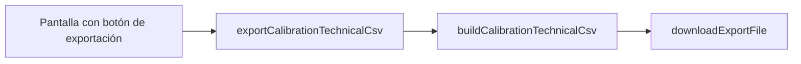

# README técnico del archivo CSV de calibración de RESPIRA+

**Autor institucional:** Equipo RESPIRA+, Tecnológico de Monterrey  
**Fecha:** Junio de 2026  
**Versión del documento:** 1.0  
**Versión del esquema CSV exportado:** 2.4.0 (`CALIBRATION_EXPORT_SCHEMA_VERSION`)

---

## Resumen

El archivo CSV de calibración técnica de RESPIRA+ es un artefacto de exportación generado por la aplicación móvil para documentar la relación entre la distancia medida por el sensor Time-of-Flight (ToF) y el volumen estimado en mililitros. El archivo combina metadatos de trazabilidad, identificación del espirómetro y del sistema electrónico, coeficientes del modelo matemático activo, métricas de ajuste y, cuando corresponde, una fila por punto de calibración capturado. Su finalidad es respaldar auditorías metrológicas, revisiones técnicas y documentación académica del estado de calibración; no constituye un reporte clínico ni un expediente de paciente.

---

## Propósito del archivo

El CSV técnico sirve para:

1. **Trazabilidad metrológica** del modelo distancia–volumen vigente en un dispositivo RESPIRA+.
2. **Auditoría técnica** de calibraciones predeterminadas de banco o de calibraciones capturadas manualmente en modo técnico.
3. **Validación documental** del modelo de conversión (pendiente, intercepto, métricas de error).
4. **Respaldo** ante cambios de firmware, montaje o unidad física de espirómetro.
5. **Comunicación** con asesores, revisores de código o personal de laboratorio que no accede a la app.

La generación está implementada en `src/modules/export/formatters/calibration-technical-csv-exporter.ts` y se invoca mediante `exportCalibrationTechnicalCsv()` en `src/modules/export/services/calibration-technical-export-service.ts`.

---

## Alcance

Este documento describe únicamente el **CSV de calibración técnica** exportado desde RESPIRA+. Abarca:

- Calibración predeterminada oficial (banco, junio de 2026).
- Calibraciones técnicas capturadas en laboratorio con `EXPO_PUBLIC_ENABLE_TECHNICAL_CALIBRATION=true`.

No cubre exportaciones de sesiones de terapia, historial clínico del paciente ni informes PDF. El volumen registrado es **estimado** a partir de distancia; la app no sustituye la lectura directa del espirómetro de referencia en tiempo real dentro del CSV.

---

## Descripción general del proceso de calibración

1. El **ESP32** (firmware `envio_datos_stream_button.ino`) transmite por WebSocket la distancia filtrada en milímetros (`distanceMm`, `rawDistanceMm`, `distanceValid`).
2. La **aplicación móvil** convierte distancia a volumen mediante el modelo activo almacenado en `ActiveCalibrationModel`.
3. El modelo vigente en producción es **regresión lineal** (`linear_regression`):  
   \(V = 28{,}66324925966009 \times d - 523{,}8262554875091\) (mL, con \(d\) en mm).
4. El espirómetro de referencia del sistema es **MediMetrics Medical Technologies MV1811-3**, capacidad nominal **3000 mL**.
5. La calibración oficial de banco tiene fecha **2026-06-02** y se instala automáticamente al primer uso (`predefined-calibration-service.ts`).

---

## Calibración oficial vigente

| Parámetro | Valor |
|-----------|--------|
| ID visible | `R3K-20260602-LIN-v2` |
| ID interno (perfil / `calibration_id`) | `cal-predefined-respira-3000-v20260602` |
| Fecha de calibración | 2026-06-02 |
| Ecuación | \(V = 28{,}66324925966009 \times \mathrm{distanceMm} - 523{,}8262554875091\) |
| Pendiente (`slope`) | 28,66324925966009 mL/mm |
| Intercepto (`intercept`) | −523,8262554875091 mL |
| Coeficiente de determinación (R²) | 0,9922 (valor completo en código: 0,9921507156019185) |
| Error absoluto medio (MAE) | 65,36 mL |
| Raíz del error cuadrático medio (RMSE) | 72,41 mL |
| Error máximo absoluto | 105,97 mL |
| Puntos de banco (ajuste) | 40 (8 volúmenes × 5 repeticiones) |
| Capacidad nominal | 3000 mL |
| Sensor | VL53L0X / GY-530 ToF |
| Microcontrolador | ESP32 WROOM 32 WiFi + Bluetooth 4.2 DevKit V1 |
| Firmware de referencia | `envio_datos_stream_button.ino` |
| Comunicación | WiFi local + WebSocket (`ws://192.168.4.1:81`) |
| Origen en app | `team_validated` (`RESPIRA_3000_PREDEFINED_SOURCE`) |
| Marca temporal de exporte de banco | `2026-06-03T01:07:42.184Z` (`RESPIRA_3000_PREDEFINED_EXPORTED_AT_UTC`) |

Constantes: `src/modules/device/calibration/predefined-calibration-models.ts`.

---

## Cómo se genera el CSV (auditoría técnica)

### Flujo de generación

1. Una pantalla invoca `exportCalibrationTechnicalCsv(options?)`.
2. El servicio carga `CalibrationProfile` y, salvo `exportSessionOnly: true`, el `ActiveCalibrationModel` desde `loadActiveVolumeEstimationContext()`.
3. `buildCalibrationTechnicalCsv()` arma un texto CSV con BOM UTF-8 (`\uFEFF`), secciones compacta y ancha, y descarga con nombre `respira_calibracion_tecnica_{etiqueta}_{timestamp}.csv`.

### Pantallas y botones de descarga

| Pantalla | Botón / acción | Contexto típico |
|----------|----------------|-----------------|
| `CalibrationTechnicalSummaryScreen` | «Descargar CSV técnico» | Resumen técnico; perfil + modelo activo |
| `SensorCalibrationTechnicalCaptureScreen` | «Exportar CSV técnico» | Captura en vivo; `exportSessionOnly: true`; métricas completas en `technicalContext` |
| `SensorCalibrationTechnicalScreen` | «Exportar archivo técnico» | Perfil cargado |
| `DataExportScreen` | Exportación de calibración | Perfil activo desde storage |

### Esquema y estructura del archivo

| Aspecto | Valor |
|---------|--------|
| Versión de esquema | **2.4.0** (`CALIBRATION_EXPORT_SCHEMA_VERSION`) |
| Formato de filas en tabla ancha | **Una fila por punto** de calibración; metadatos del modelo **repetidos** en cada fila |
| Fila sin puntos | Si no hay puntos ni curva, se emite **una fila vacía** de datos (solo metadatos en columnas base) |
| Sección compacta | Tabla `# RESPIRA_METADATA_COMPACT` + puntos resumidos (8 columnas) |
| Sección ancha | `# RESPIRA_LEGACY_WIDE_FORMAT` + cabecera de **146 columnas** + filas de datos |

**Nota metrológica:** En calibración predeterminada oficial, `points_count` en la sección compacta reporta **40** (capturas de banco usadas en el ajuste), mientras que la tabla ancha puede listar **9 puntos** de curva de referencia por tramos (`calibrationCurve`, incluye punto extrapolado a 0 mL). El ID visible `R3K-20260602-LIN-v2` aparece en la sección compacta como `display_calibration_id`, no como columna de la tabla ancha.

### Confirmación de alineación con v20260602

Cuando `activeModel.predefinedCalibration.predefinedId === cal-predefined-respira-3000-v20260602` y `source === team_validated`, el exportador:

- Fija `calibration_id` y `calibration_profile_id` al ID interno **v20260602**.
- Inyecta en metadatos compactos `display_calibration_id` = **R3K-20260602-LIN-v2**.
- Usa `exported_at` = `RESPIRA_3000_PREDEFINED_EXPORTED_AT_UTC`.
- Fija `points_count` = **40**.
- Toma pendiente, intercepto y métricas del `linearModel` activo (valores de banco anteriores).

**No** existe rama que exporte la calibración del 30 de mayo de 2026 como vigente; los IDs obsoletos solo se usan en migración de storage (`STALE_PREDEFINED_CALIBRATION_IDS`), no en el exportador.

---

## Estructura del CSV — diccionario de datos (tabla ancha)

**Total de columnas documentadas: 146** (66 columnas base + 80 columnas de métricas técnicas).

Convenciones:

- **Obligatoria:** siempre presente en la cabecera; el valor puede ir vacío según contexto.
- **Opcional:** frecuentemente vacía según tipo de calibración.
- **Pred.:** aplica con calibración predeterminada oficial.
- **Téc.:** aplica con captura manual en modo técnico (puntos en `profile.points`).

### 1. Trazabilidad y versión de exportación

| Columna | Descripción | Unidad | Fuente en la app | Obl. | Observaciones |
|---------|-------------|--------|------------------|------|---------------|
| `calibration_export_schema_version` | Versión del formato CSV | Texto (semver) | Constante `CALIBRATION_EXPORT_SCHEMA_VERSION` | Sí | Valor actual: 2.4.0 |
| `app_version` | Versión de la app Expo | Texto | `expo-constants` | Sí | |
| `exported_at` | Marca de tiempo del exporte | ISO 8601 UTC | `RESPIRA_3000_PREDEFINED_EXPORTED_AT_UTC` o `Date.now()` | Sí | Pred.: timestamp de banco |

### 2. Identificación del dispositivo y calibración

| Columna | Descripción | Unidad | Fuente en la app | Obl. | Observaciones |
|---------|-------------|--------|------------------|------|---------------|
| `calibration_id` | Identificador principal de calibración | Texto | `predefinedId` o `profile.id` | Sí | Pred.: `cal-predefined-respira-3000-v20260602` |
| `calibration_profile_id` | ID del perfil de calibración | Texto | Igual que `calibration_id` en pred. | Sí | |
| `calibration_name` | Nombre del perfil | Texto | `CalibrationProfile.name` | Sí | |
| `calibration_version` | Versión de esquema del perfil | Entero (texto) | `profile.version` | Sí | |
| `calibration_created_at` | Creación del perfil | ISO 8601 | `profile.createdAt` | Sí | |
| `calibration_updated_at` | Última actualización | ISO 8601 | `profile.updatedAt` | Sí | |
| `calibration_source` | Origen del perfil | Texto | `predefined.source` o `profile.source` | Sí | Pred.: `team_validated` |
| `device_internal_label` | Etiqueta interna | Texto | `deviceIdentification.internalLabel` | Sí | Default: RESPIRA+ 3000 mL |
| `device_brand` | Marca del espirómetro | Texto | `deviceIdentification.brand` | Sí | MediMetrics… |
| `device_model` | Modelo | Texto | `deviceIdentification.model` | Sí | MV1811-3 |
| `device_nominal_capacity_ml` | Capacidad nominal | mL | `deviceIdentification.nominalCapacityMl` | Sí | 3000 |
| `device_serial_number` | Número de serie | Texto | `deviceIdentification.serialNumber` | Opc. | Téc.: si el operador lo captura |
| `calibration_operator` | Operador de calibración | Texto | `deviceIdentification.calibrationOperator` | Opc. | Téc. |
| `calibration_date` | Fecha de calibración | YYYY-MM-DD | `predefined.calibrationDateIso` o identificación | Sí | Pred.: 2026-06-02 |
| `technical_notes` | Notas técnicas | Texto | Identificación o `profile.notes` | Opc. | |
| `spirometer_model` | Modelo compuesto | Texto | Importado o marca+modelo | Sí | |
| `spirometer_capacity_ml` | Capacidad operativa | mL | Perfil / snapshot | Sí | |
| `spirometer_device_id` | ID dispositivo lógico | Texto | `profile.spirometerDeviceId` | Sí | |
| `spirometer_profile_id` | ID perfil de espirómetro | Texto | `profile.spirometerProfileId` | Sí | |
| `notes` | Notas del perfil | Texto | `profile.notes` | Opc. | |

### 3. Componentes del sistema RESPIRA+

| Columna | Descripción | Unidad | Fuente en la app | Obl. | Observaciones |
|---------|-------------|--------|------------------|------|---------------|
| `system_microcontroller` | Microcontrolador | Texto | `RESPIRA_SYSTEM_COMPONENTS` | Sí | Fijo en export |
| `system_sensor` | Sensor ToF | Texto | `RESPIRA_SYSTEM_COMPONENTS` | Sí | VL53L0X / GY-530 |
| `system_firmware_reference` | Sketch de referencia | Texto | `RESPIRA_SYSTEM_COMPONENTS` | Sí | envio_datos_stream_button.ino |
| `system_communication` | Canal de datos | Texto | `RESPIRA_SYSTEM_COMPONENTS` | Sí | WiFi + WebSocket |
| `firmware_version` | Versión reportada por ESP32 | Texto | Última lectura WS | Opc. | Vacío si el JSON no la envía |
| `device_id` | ID de dispositivo en stream | Texto | Última lectura WS | Opc. | Téc. con sensor conectado |
| `filter_label` | Etiqueta de filtro (si aplica) | Texto | Lectura / contexto | Opc. | |
| `sensor_status` | Estado de conexión del sensor | Texto | Hook de sensor | Opc. | Téc. |

### 4. Modelo matemático y métricas duplicadas (columnas base)

| Columna | Descripción | Unidad | Fuente en la app | Obl. | Observaciones |
|---------|-------------|--------|------------------|------|---------------|
| `active_model_id` | ID del modelo activo | Texto | `activeModel.id` | Opc. | Vacío en export solo sesión |
| `model_kind` | Tipo de modelo activo | Texto | `activeModel.modelKind` | Opc. | Pred.: `linear_regression` |
| `model_type` | Alias de `model_kind` | Texto | Igual que `model_kind` | Opc. | |
| `slope_ml_per_mm` | Pendiente del ajuste lineal | mL/mm | `linearModel.coefficients.slope` | Opc. | Pred.: 28,66324925966009 |
| `intercept_ml` | Intercepto | mL | `linearModel.coefficients.intercept` | Opc. | Pred.: −523,8262554875091 |
| `model_slope` | Duplicado de pendiente | mL/mm | Mismo coeficiente | Opc. | Compatibilidad legacy |
| `model_intercept` | Duplicado de intercepto | mL | Mismo coeficiente | Opc. | |
| `r_squared` | R² del modelo lineal | Adimensional | `linearModel.metrics` | Opc. | Pred.: ≈0,9922 |
| `mae_ml` | MAE | mL | Métricas del modelo | Opc. | Pred.: ≈65,36 |
| `rmse_ml` | RMSE | mL | Métricas del modelo | Opc. | Pred.: ≈72,41 |
| `model_r2` | Duplicado de R² | Adimensional | Métricas | Opc. | |
| `model_rmse_ml` | Duplicado RMSE | mL | Métricas | Opc. | |
| `model_mae_ml` | Duplicado MAE | mL | Métricas | Opc. | |
| `model_max_abs_error_ml` | Error máximo absoluto | mL | Métricas | Opc. | Pred.: ≈105,97 |

### 5. Activación y readiness

| Columna | Descripción | Unidad | Fuente en la app | Obl. | Observaciones |
|---------|-------------|--------|------------------|------|---------------|
| `activation_status` | Estado de activación | Texto | Derivado de `isReadyForTherapy` | Sí | `active_ready`, `active_not_ready`, `not_activated` |
| `therapy_ready` | Listo para terapia | Booleano (texto) | `activeModel.isReadyForTherapy` | Sí | `true` / `false` |

### 6. Datos por punto de calibración (varían por fila)

| Columna | Descripción | Unidad | Fuente en la app | Obl. | Observaciones |
|---------|-------------|--------|------------------|------|---------------|
| `point_id` | Identificador del punto | Texto | `CalibrationCapturePoint.id` o `curve-{volume}` | Por fila | Vacío en fila resumen sin puntos |
| `mark_ml` | Volumen marcado / referencia | mL | `point.volumeMl` | Por fila | |
| `target_volume_ml` | Volumen objetivo | mL | Igual a `mark_ml` | Por fila | |
| `repetition_number` | Número de repetición | Entero | `point.repetitionNumber` | Por fila | Téc.: ≥1; Pred. en curva: 0 |
| `filtered_distance_mm` | Distancia filtrada | mm | `point.distanceMm` | Por fila | |
| `avg_distance_mm` | Distancia media | mm | `point.distanceMm` | Por fila | |
| `raw_distance_mm` | Distancia cruda | mm | `point.rawDistanceMm` | Por fila | |
| `samples_count` | Muestras en buffer | Entero | `point.sampleCount` | Por fila | |
| `std_distance_mm` | Desv. típica de distancia | mm | `point.stdDistanceMm` | Por fila | Téc. |
| `min_distance_mm` | Mínimo en buffer | mm | `point.minSampleDistanceMm` | Por fila | |
| `max_distance_mm` | Máximo en buffer | mm | `point.maxSampleDistanceMm` | Por fila | |
| `sample_count` | Alias de conteo | Entero | `point.sampleCount` | Por fila | |
| `predicted_volume_ml` | Volumen predicho por modelo | mL | `volumeFromLinear(distance, slope, intercept)` | Por fila | |
| `residual_ml` | Residual (predicho − referencia) | mL | Calculado en exportador | Por fila | |
| `absolute_error_ml` | Valor absoluto del residual | mL | Calculado | Por fila | |
| `uncertainty_u95_ml` | Incertidumbre expandida k≈2 | mL | `activeModel.uncertaintyByVolumeMl` | Opc. | Téc. si se calculó U95 |
| `accepted` | Punto aceptado | Booleano (texto) | `point.distanceValid` | Por fila | |
| `rejection_reason` | Motivo de rechazo | Texto | Derivado | Por fila | p. ej. `distance_invalid` |
| `source` | Origen de la captura | Texto | `point.source` | Por fila | |

### 7. Métricas técnicas, cobertura, repetibilidad e incertidumbre (80 columnas)

Estas columnas se rellenan principalmente cuando se pasa `CalibrationTechnicalExportContext` (captura técnica). En export desde resumen predeterminado, muchas permanecen vacías salvo campos de `predefinedCalibration` y rango global.

| Columna | Descripción | Unidad | Fuente | Obl. | Pred. / Téc. |
|---------|-------------|--------|--------|------|--------------|
| `volume_summaries_json` | Resúmenes por volumen serializados | JSON | `profile.summaries` | Opc. | Téc. |
| `volume_distance_relation` | Relación volumen–distancia | Texto | `direct` / `inverse` / `indeterminate` | Opc. | Téc. |
| `recommended_model_kind` | Modelo recomendado | Texto | `recommendCalibrationModel` | Opc. | Téc. |
| `recommended_model_status` | Estado de recomendación | Texto | Recomendación | Opc. | Téc. |
| `recommended_calibration_quality` | Calidad global | Texto | Recomendación | Opc. | Téc. |
| `recommended_lineal_quality` | Calidad lineal | Texto | Recomendación | Opc. | Téc. |
| `recommended_can_estimate_in_range` | Puede estimar en rango | Booleano | Recomendación | Opc. | Téc. |
| `recommended_is_ready_for_therapy` | Listo para terapia (recom.) | Booleano | Recomendación | Opc. | Téc. |
| `therapy_readiness_reason` | Motivo de readiness | Texto | `activeModel` / recomendación | Opc. | Ambos |
| `model_recommendation_reason` | Razón del modelo elegido | Texto | Recomendación | Opc. | Téc. |
| `model_warnings_json` | Advertencias del modelo | JSON | Recomendación | Opc. | Téc. |
| `coverage_recommended_pct` | Cobertura 500–3000 mL | % | Cobertura | Opc. | Téc. |
| `coverage_total_pct` | Cobertura total | % | Cobertura | Opc. | Téc. |
| `coverage_covered_min_ml` | Mínimo cubierto | mL | Cobertura | Opc. | Téc. |
| `coverage_covered_max_ml` | Máximo cubierto | mL | Cobertura | Opc. | Téc. |
| `covers_recommended` | Cubre rango recomendado | Booleano | Cobertura | Opc. | Téc. |
| `covers_total` | Cubre rango total | Booleano | Cobertura | Opc. | Téc. |
| `global_distance_min_mm` | Distancia mínima global | mm | `profile.globalRange` | Opc. | Ambos |
| `global_distance_max_mm` | Distancia máxima global | mm | `profile.globalRange` | Opc. | Ambos |
| `global_distance_range_mm` | Rango de distancia | mm | `profile.globalRange` | Opc. | Ambos |
| `repeatability_per_volume_json` | Repetibilidad por volumen | JSON | Informe repetibilidad | Opc. | Téc. |
| `repeatability_volume_max_std_ml` | Volumen con máx. std | mL | Repetibilidad | Opc. | Téc. |
| `calibrated_range_min_ml` | Rango calibrado mín. | mL | `activeModel.calibratedRangeMl` | Opc. | Pred. |
| `calibrated_range_max_ml` | Rango calibrado máx. | mL | `activeModel.calibratedRangeMl` | Opc. | Pred. |
| `activated_at` | Activación del modelo | Epoch ms (texto) | `activeModel.activatedAt` | Opc. | Pred. |
| `active_model_therapy_ready` | Terapia lista (activo) | Booleano | `activeModel` | Opc. | Pred. |
| `protocol_meets_required` | Cumple protocolo mínimo | Booleano | Protocolo | Opc. | Téc. |
| `protocol_total_valid_points` | Puntos válidos totales | Entero | Protocolo | Opc. | Téc. |
| `missing_required_volumes_json` | Volúmenes faltantes | JSON | Protocolo | Opc. | Téc. |
| `repeatability_min_repetitions` | Mín. repeticiones | Entero | Repetibilidad | Opc. | Téc. |
| `repeatability_avg_std_mm` | Media de std (mm) | mm | Repetibilidad | Opc. | Téc. |
| `repeatability_max_std_mm` | Máx. std entre volúmenes | mm | Repetibilidad | Opc. | Téc. |
| `segment_count` | Número de segmentos | Entero | Informe de segmentos | Opc. | Téc. |
| `segment_slope_min_ml_per_mm` | Pendiente mín. por tramo | mL/mm | Segmentos | Opc. | Téc. |
| `segment_slope_max_ml_per_mm` | Pendiente máx. por tramo | mL/mm | Segmentos | Opc. | Téc. |
| `segment_slope_variation_ratio` | Variación de pendiente | Adimensional | Segmentos | Opc. | Téc. |
| `segments_json` | Detalle de segmentos | JSON | Segmentos | Opc. | Téc. |
| `geometric_validation_configured` | Validación geométrica activa | Booleano | Perfil legacy 5000 mL | Opc. | Legacy |
| `geometric_validation_passed` | Validación geométrica OK | Booleano | Geométrica | Opc. | Legacy |
| `geometric_ok_segments` | Tramos OK | Entero | Geométrica | Opc. | Legacy |
| `geometric_review_segments` | Tramos en revisión | Entero | Geométrica | Opc. | Legacy |
| `geometric_critical_segments` | Tramos críticos | Entero | Geométrica | Opc. | Legacy |
| `uncertainty_avg_u95_ml` | U95 promedio | mL | Resumen incertidumbre | Opc. | Téc. |
| `uncertainty_max_u95_ml` | U95 máximo | mL | Resumen incertidumbre | Opc. | Téc. |
| `linear_model_kind` | Tipo modelo lineal | Texto | `CalibrationModel` | Opc. | Ambos |
| `linear_model_status` | Estado | Texto | Modelo | Opc. | Ambos |
| `linear_model_slope` | Pendiente (prefijo) | mL/mm | Modelo lineal | Opc. | Ambos |
| `linear_model_intercept` | Intercepto (prefijo) | mL | Modelo lineal | Opc. | Ambos |
| `linear_model_r2` | R² (prefijo) | Adimensional | Modelo | Opc. | Ambos |
| `linear_model_rmse_ml` | RMSE (prefijo) | mL | Modelo | Opc. | Ambos |
| `linear_model_mae_ml` | MAE (prefijo) | mL | Modelo | Opc. | Ambos |
| `linear_model_max_abs_error_ml` | Error máx. (prefijo) | mL | Modelo | Opc. | Ambos |
| `linear_model_volume_range_ml` | Rango de volumen | mL (texto min-max) | Modelo | Opc. | Ambos |
| `linear_model_distance_range_mm` | Rango de distancia | mm (texto) | Modelo | Opc. | Ambos |
| `linear_model_warnings_json` | Advertencias lineales | JSON | Modelo | Opc. | Ambos |
| `piecewise_model_kind` | Tipo piecewise | Texto | Modelo referencia | Opc. | Pred. (ref.) |
| `piecewise_model_status` | Estado piecewise | Texto | Modelo | Opc. | Pred. (ref.) |
| `piecewise_model_slope` | Pendiente piecewise | mL/mm | Solo si aplica | Opc. | Ref. |
| `piecewise_model_intercept` | Intercepto piecewise | mL | Solo si aplica | Opc. | Ref. |
| `piecewise_model_r2` | R² piecewise | Adimensional | Modelo ref. | Opc. | Ref. |
| `piecewise_model_rmse_ml` | RMSE piecewise | mL | Modelo ref. | Opc. | Ref. |
| `piecewise_model_mae_ml` | MAE piecewise | mL | Modelo ref. | Opc. | Ref. |
| `piecewise_model_max_abs_error_ml` | Error máx. piecewise | mL | Modelo ref. | Opc. | Ref. |
| `piecewise_model_volume_range_ml` | Rango volumen PW | mL (texto) | Modelo | Opc. | Ref. |
| `piecewise_model_distance_range_mm` | Rango distancia PW | mm (texto) | Modelo | Opc. | Ref. |
| `piecewise_model_warnings_json` | Advertencias PW | JSON | Modelo | Opc. | Ref. |
| `piecewise_segments_json` | Coeficientes / tramos PW | JSON | Modelo piecewise | Opc. | Ref. |
| `predefined_calibration_id` | ID interno predeterminada | Texto | `predefined.predefinedId` | Opc. | Pred.: v20260602 |
| `calibration_origin_label` | Etiqueta de origen | Texto | `predefined.originLabel` | Opc. | Pred. |
| `display_range_min_ml` | Mínimo visualización | mL | `predefined.displayRangeMl` | Opc. | Pred.: 0 |
| `display_range_max_ml` | Máximo visualización | mL | `predefined.displayRangeMl` | Opc. | Pred.: 3000 |
| `capacity_ml` | Capacidad nominal | mL | `predefined.capacityMl` | Opc. | Pred.: 3000 |
| `active_model_kind` | Tipo de modelo activo | Texto | `activeModel.modelKind` | Opc. | Pred. |
| `clamp_min_ml` | Límite inferior clamp | mL | `predefined.clampMinMl` | Opc. | Pred.: 0 |
| `clamp_max_ml` | Límite superior clamp | mL | `predefined.clampMaxMl` | Opc. | Pred.: 3000 |
| `linear_model_metrics_json` | Métricas lineales completas | JSON | `predefined.linearModel` | Opc. | Pred. |
| `piecewise_reference_json` | Puntos de referencia PW | JSON | `piecewiseReferencePoints` | Opc. | Pred. |
| `calibration_point_estimated` | Punto extrapolado | Booleano | Curva con `estimated` | Por fila | Pred.: punto 0 mL |

### 8. Sección compacta (fuera de la tabla ancha)

| Clave (`metadata_key`) | Descripción | Unidad | Fuente |
|------------------------|-------------|--------|--------|
| `calibration_type` | Tipo de export | Texto | Fijo: `technical` |
| `calibration_id` | ID interno | Texto | Perfil / predeterminada |
| `display_calibration_id` | ID visible trazable | Texto | `R3K-20260602-LIN-v2` (solo pred. oficial) |
| `exported_at_utc_source` | Timestamp fuente banco | ISO UTC | Constante de banco |
| `spirometer_type` | Tipo resumido | Texto | `3000mL` o `5000mL` |
| `created_at` | Creación / exporte | ISO UTC | Ver exportador |
| `model_type` | Familia de modelo | Texto | `linear` |
| `slope`, `intercept` | Coeficientes | mL/mm, mL | Modelo lineal |
| `r_squared`, `mae_ml`, `rmse_ml`, `max_abs_error_ml` | Métricas | Varias | Modelo |
| `points_count` | Conteo de puntos de banco | Entero | 40 en pred. oficial |
| `technical_notes` | Notas | Texto | Opcional |

Tabla de puntos compacta (por fila): `point_index`, `reference_volume_ml`, `distance_mm`, `filtered_distance_mm`, `estimated_volume_ml`, `error_ml`, `abs_error_ml`, `timestamp`.

---

## Categorías de columnas (resumen)

1. **Identificación del dispositivo** — etiqueta, marca, modelo, capacidad, serie, operador, fecha.  
2. **Metadatos de calibración** — IDs, versión, timestamps, origen, notas.  
3. **Componentes del sistema** — microcontrolador, sensor, firmware de referencia, comunicación.  
4. **Datos por punto** — distancias, repeticiones, predicción, residual, U95 por volumen.  
5. **Modelo matemático** — pendiente, intercepto, tipo, rangos.  
6. **Métricas estadísticas** — R², MAE, RMSE, error máximo (columnas base y prefijadas).  
7. **Incertidumbre y repetibilidad** — U95 agregado y por volumen; std entre repeticiones.  
8. **Cobertura y validación** — porcentajes, protocolo, geometría (legacy 5000 mL).  
9. **Campos JSON** — resúmenes, segmentos, advertencias, referencia piecewise.  
10. **Estado de activación** — `activation_status`, `therapy_ready`, `activated_at`.

---

## Interpretación de métricas

### Coeficientes del modelo lineal

- **Pendiente (`slope`, mL/mm):** cambio estimado de volumen por milímetro de desplazamiento del pistón según el montaje calibrado.  
- **Intercepto (`intercept`, mL):** volumen estimado cuando la distancia es 0 mm en el modelo; no implica volumen físico real sin extrapolación controlada.

### Métricas de bondad de ajuste (sobre puntos de banco o captura)

- **R² (`r_squared`, `model_r2`):** proporción de varianza de volumen explicada por el modelo lineal respecto a los puntos usados en el ajuste. Valores cercanos a 1 indican ajuste consistente; no implican validez clínica por sí solos.  
- **MAE (`mae_ml`):** promedio del valor absoluto de los residuales en mL.  
- **RMSE (`rmse_ml`):** raíz cuadrada del error cuadrático medio en mL; penaliza errores grandes más que el MAE.  
- **Error máximo absoluto (`model_max_abs_error_ml`):** peor desviación puntual entre volumen de referencia y predicho.

### Residuales por fila

- **`residual_ml`:** volumen predicho − volumen de referencia (mL).  
- **`absolute_error_ml`:** valor absoluto del residual.

### Incertidumbre U95

Cuando la calibración técnica calcula incertidumbre (`calibration-uncertainty-types`, modo técnico), **`uncertainty_u95_ml`** reporta la incertidumbre expandida aproximada con factor de cobertura **k = 2** (~95 % de confianza bajo supuestos del módulo). En export de calibración predeterminada sin captura, suele estar **vacía** por volumen.

### Repetibilidad y cobertura

- **Repetibilidad:** dispersión de distancias entre repeticiones al mismo volumen; alta std sugiere inestabilidad del montaje o señal.  
- **Cobertura:** fracción del rango 500–3000 mL (u otro) con puntos válidos; relevante para calibraciones custom en modo técnico.

---

## Interpretación de campos JSON

| Campo | Contenido típico | Lectura recomendada |
|-------|------------------|---------------------|
| `volume_summaries_json` | Array de promedios por volumen | Estadísticos agregados por nivel |
| `model_warnings_json` | Lista de advertencias | Revisar antes de aceptar modelo |
| `repeatability_per_volume_json` | Std y flags por volumen | Identificar volúmenes a recapturar |
| `missing_required_volumes_json` | Volúmenes obligatorios faltantes | Protocolo incompleto |
| `segments_json` | Pendientes entre volúmenes consecutivos | Detectar no linealidad local |
| `linear_model_metrics_json` | Objeto completo de métricas pred. | Copia estructurada del banco |
| `piecewise_reference_json` | Puntos de curva por tramos | **No** es el modelo activo en producción |
| `piecewise_segments_json` | Coeficientes piecewise | Solo calibración técnica avanzada |

Los campos JSON se serializan en una sola celda CSV entre comillas si contienen comas o saltos de línea.

---

## Uso recomendado

- Archivar un CSV por evento de calibración con fecha y operador en el nombre de archivo externo.  
- Comparar `slope`, `intercept` y MAE/RMSE entre sesiones de laboratorio.  
- Verificar que `calibration_id` coincida con `cal-predefined-respira-3000-v20260602` en dispositivos de producción.  
- Usar `display_calibration_id` de la sección compacta para trazabilidad humana (`R3K-20260602-LIN-v2`).  
- No utilizar este archivo como única evidencia de desempeño clínico del paciente.

---

## Limitaciones

1. El **volumen es estimado** a partir de la distancia ToF; depende del montaje físico sensor–pistón–espirómetro.  
2. La calibración aplica al **sistema RESPIRA+ concreto** (unidad + app + firmware de referencia).  
3. El CSV **no sustituye** validación clínica formal ni certificación de producto sanitario (ver README del proyecto).  
4. **No es expediente clínico** ni contiene datos identificables del paciente en el export de calibración.  
5. **`firmware_version` y `device_id`** pueden ir vacíos si el firmware de referencia no los incluye en el JSON.  
6. La **incertidumbre U95** solo es significativa cuando se ejecutó el pipeline completo de captura técnica.  
7. Discrepancia **40 puntos (ajuste) vs. filas en tabla ancha (curva resumida)** en calibración predeterminada: documentar ambos al interpretar.

---

## Control de versiones de calibración

| Versión de calibración | Fecha | ID visible | ID interno | Estado | Comentario |
|------------------------|-------|------------|------------|--------|------------|
| R3K-20260602-LIN-v2 | 2026-06-02 | R3K-20260602-LIN-v2 | cal-predefined-respira-3000-v20260602 | **Vigente** | Calibración oficial de banco; exportada por defecto |
| Perfiles en `STALE_PREDEFINED_CALIBRATION_IDS` | Varias | — | p. ej. v20260530 | Obsoleta | Migración automática a v20260602; no exportada como vigente |
| Ecuación legacy 32,566738 / −1270,5786 | — | — | — | Obsoleta | Solo detección de migración en código |

---

## Recomendaciones para futuras calibraciones

Al validar una nueva calibración de banco que reemplace la oficial:

1. Registrar **fecha**, **operador**, **espirómetro** (marca, modelo, serie), **firmware** y versión de app.  
2. Documentar **puntos de captura** (volúmenes, repeticiones, distancias medias).  
3. Publicar **modelo** (`linear_regression`), **pendiente**, **intercepto** y métricas (R², MAE, RMSE, error máximo).  
4. Asignar **ID visible** e **ID interno** nuevos (convención `R3K-YYYYMMDD-LIN-vN`).  
5. Exportar CSV con esquema ≥ 2.4.0 y archivar junto al informe de banco.  
6. Actualizar `predefined-calibration-models.ts` y migración `STALE_*` antes de liberar la app.  
7. Criterio de reemplazo: mejora demostrada en métricas de error y repetibilidad en banco, con revisión del equipo RESPIRA+; no sustituye protocolo de validación clínica acordado por el proyecto.

---

## Referencias

Equipo RESPIRA+. (2026). *README del proyecto RESPIRA+* [Documento interno]. Tecnológico de Monterrey.

Equipo RESPIRA+. (2026). *Calibración del espirómetro — documentación de flujo* [Documento interno]. Tecnológico de Monterrey. `docs/calibration/README.md`

Equipo RESPIRA+. (2026). *Documentación técnica del módulo de calibración RESPIRA+* [Documento interno]. Tecnológico de Monterrey. `src/modules/device/calibration/README.md`

Equipo RESPIRA+. (2026). *Auditoría técnica sensor ESP32 y calibración* [Documento interno]. Tecnológico de Monterrey. `docs/AUDITORIA-TECNICA-SENSOR-ESP32.md`

Equipo RESPIRA+. (2026). *Flujo de datos del sensor RESPIRA+* [Documento interno]. Tecnológico de Monterrey. `docs/sensor-flow.md`

Equipo RESPIRA+. (2026). *Exportador CSV de calibración técnica* [Código fuente interno]. Módulos `calibration-technical-csv-exporter.ts`, `calibration-technical-export-context.ts`, `calibration-technical-export-service.ts`.

---

## Apéndice: implementación revisada (auditoría junio 2026)

**Archivos revisados:**  
`calibration-technical-csv-exporter.ts`, `calibration-technical-export-context.ts`, `calibration-technical-export-service.ts`, `predefined-calibration-models.ts`, `predefined-calibration-service.ts`, `calibration-types.ts`, `active-calibration-types.ts`, `respira-system-components.ts`, `CalibrationTechnicalSummaryScreen.tsx`, `SensorCalibrationTechnicalCaptureScreen.tsx`, `SensorCalibrationTechnicalScreen.tsx`, `DataExportScreen.tsx`, `docs/calibration/README.md`, `src/modules/device/calibration/README.md`.

**Hallazgos sin cambio de código (informativos):**

- El ID visible **R3K-20260602-LIN-v2** no tiene columna dedicada en la tabla ancha; consultar sección `# RESPIRA_METADATA_COMPACT`.  
- No se detectó exportación de la calibración de mayo de 2026 como vigente en el exportador.  
- No se identificaron errores críticos que impidan documentar el formato actual; se recomienda futura columna `display_calibration_id` en tabla ancha solo si el equipo lo solicita (fuera de alcance de este documento).

---

*Documento alineado con esquema CSV 2.4.0 y calibración oficial R3K-20260602-LIN-v2 (junio de 2026).*
