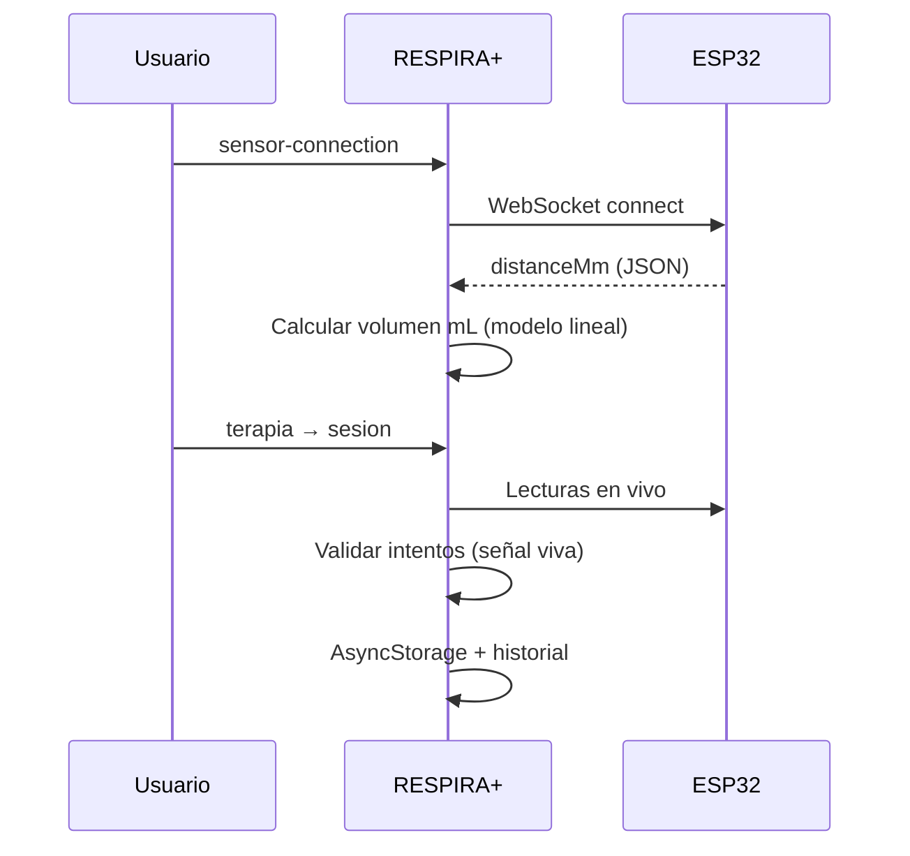

# Flujo del sensor RESPIRA+

Documento de referencia para el recorrido **conexión → terapia → historial**. Un solo WebSocket global; no duplicar clientes.

---

## Resumen del flujo paciente

1. **Conectar** el ESP32 por WiFi local.
2. **Ver volumen en vivo** (termómetro 0–3000 mL) en `/sensor-connection`.
3. **Iniciar terapia** cuando conexión y calibración predeterminada están listas.
4. **Validar intentos** con volumen calculado en app (no en firmware).
5. **Historial / exportación** con clasificación de origen.

La calibración lineal predeterminada RESPIRA+ 3000 mL se instala automáticamente. No hay pasos manuales de calibración en flujo paciente.

---

## 1. Conectar sensor

- **Ruta:** `/sensor-connection`
- **Provider:** `SensorConnectionProvider` (raíz en `_layout.tsx`)
- **URL por defecto:** `ws://192.168.4.1:81`
- El usuario se une al AP `RESPIRA_ESP32` del ESP32.
- **UI:** termómetro visual (`VolumeThermometer`), valor en mL, estado de señal.
- Si la señal no está viva: «Esperando señal del sensor» — no se muestra el último volumen como actual.
- **Distancia y JSON:** solo con `EXPO_PUBLIC_ENABLE_SENSOR_DEBUG=true`.

Con diagnóstico avanzado habilitado pueden mostrarse el laboratorio de hardware y la prueba WebSocket directa.

---

## 2. Calibración (automática en paciente / técnica con flag)

### Flujo paciente

- Perfil único: **RESPIRA+ 3000 mL**.
- Modelo lineal predeterminado; clamp 0–3000 mL.
- La app convierte `distanceMm` → mL; el ESP32 **no envía volumen clínico**.

### Flujo técnico (`EXPO_PUBLIC_ENABLE_TECHNICAL_CALIBRATION=true`)

- **Ruta:** `/sensor-calibration`
- Dispositivo físico (`spirometerDeviceId`) con calibración multi-volumen.
- Mínimo **6 volúmenes** obligatorios, **5** repeticiones cada uno → **30** puntos.
- Bloqueo si `distanceMm < 30` mm.
- Repetibilidad, validación geométrica (perfil **legacy** 5000 mL), recaptura, U95.

---

## 3. Iniciar terapia

- **Ruta:** `/(tabs)/terapia` (`LevelsScreen`)
- Al pulsar un nivel: `evaluateTherapyReadinessOnDemand`.
- Bloqueo de lecturas obsoletas si el stream dejó de enviar datos.
- Si falla y touch practice está habilitado: opción **Practicar sin sensor**.

---

## 4. Sesión

- **Ruta:** `/(tabs)/sesion`
- `inputMode=sensor`: `useActiveVolumeEstimate` + validación en `sensor-evaluation`.
- `inputMode=touch_practice`: entrada táctil; sin estimación de sensor.

---

## 5. Historial y exportación

- Etiquetas: **Sensor**, **Práctica**, **Sin clasificar** (`session-record-classification.ts`).
- Exportación clínica v2.1.0 con campos de clasificación y telemetría de intentos.
- Export técnico (U95, R², curvas): solo modo técnico/debug.

---

## Hardware de referencia

| Elemento | Valor |
|----------|--------|
| Firmware | `arduino_codes/envio_datos_stream_button/envio_datos_stream_button.ino` |
| Sensor | VL53L0X / GY-530 ToF |
| MCU | ESP32 WROOM 32 DevKit V1 |
| Payload | `distanceMm`, `rawDistanceMm`, `distanceValid`, `timestamp` |

---

## Diagrama

