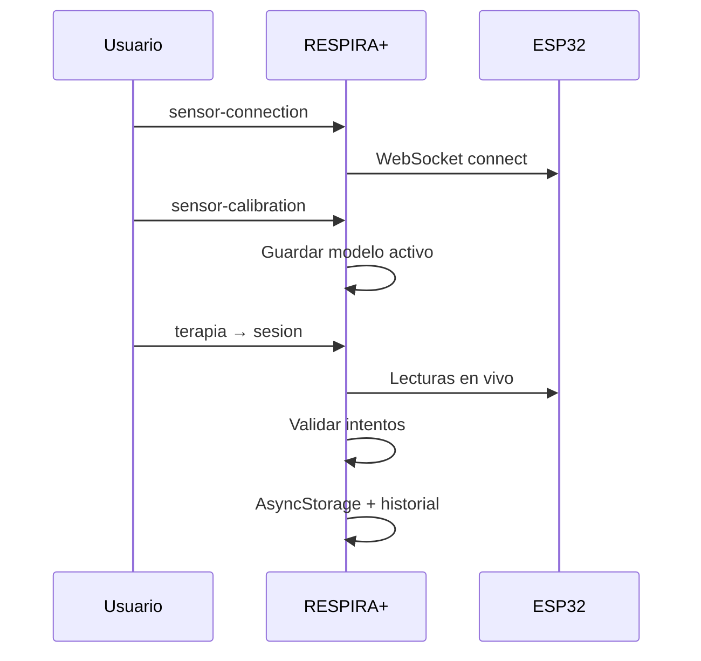

# Flujo del sensor RESPIRA+

Documento de referencia para el recorrido **conexión → calibración → terapia → historial**. Un solo WebSocket global; no duplicar clientes.

---

## 1. Conectar sensor

- **Ruta:** `/sensor-connection`
- **Provider:** `SensorConnectionProvider` (raíz en `_layout.tsx`)
- **URL por defecto:** `ws://192.168.4.1:81`
- El usuario se une al AP `RESPIRA_ESP32` del ESP32.

En desarrollo, con `EXPO_PUBLIC_ENABLE_SENSOR_DEBUG=true`, pueden mostrarse mock, Hardware Lab y raw test.

---

## 2. Seleccionar espirómetro

- Dispositivo físico (`spirometerDeviceId`) asociado a un **perfil** (5000 o 3000 mL).
- La calibración y el modelo activo son **por dispositivo**, no globales.

---

## 3. Calibrar

- **Ruta:** `/sensor-calibration`
- Mínimo **6 volúmenes** obligatorios, **5** repeticiones cada uno → **30** puntos.
- Bloqueo si `distanceMm < 30` mm.
- Repetibilidad, validación geométrica (perfil 5000), recaptura si hay alta variación.
- Incertidumbre combinada y **U95**.

---

## 4. Guardar y activar modelo

- Modelos candidatos: `linear_regression`, `piecewise_linear`.
- El **modelo activo** se persiste por espirómetro.
- `isReadyForTherapy` y `canEstimateWithinCalibratedRange` alimentan la compuerta de terapia.

---

## 5. Iniciar terapia

- **Ruta:** `/(tabs)/terapia` (`LevelsScreen`)
- Al pulsar un nivel: `evaluateTherapyReadinessOnDemand`.
- Si falla y touch practice está habilitado: opción **Practicar sin sensor**.

---

## 6. Sesión

- **Ruta:** `/(tabs)/sesion`
- `inputMode=sensor`: `useActiveVolumeEstimate` + validación en `sensor-evaluation`.
- `inputMode=touch_practice`: entrada táctil; sin estimación de sensor.

---

## 7. Historial y exportación

- Etiquetas: **Sensor**, **Práctica**, **Sin clasificar** (`session-record-classification.ts`).
- Exportación clínica v2.1.0 con campos de clasificación y telemetría de intentos.

---

## Diagrama

