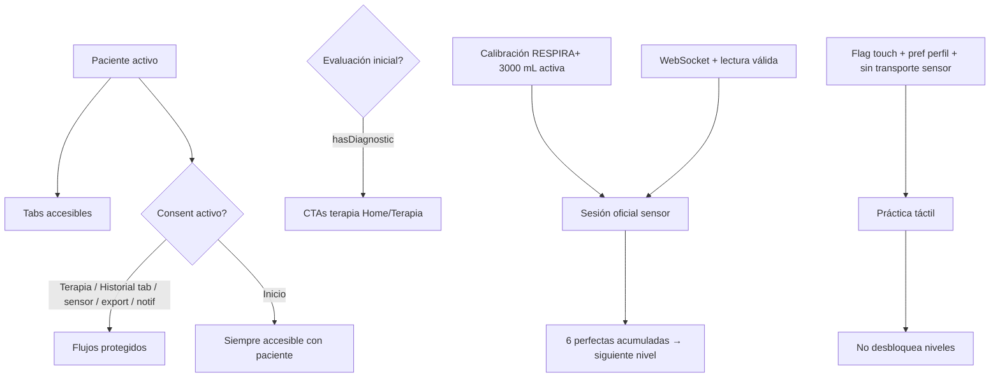

# Arquitectura técnica

Este documento describe cómo está organizado el código de RESPIRA+ y cómo se conectan las capas de routing, dominio, dispositivo y persistencia local. Está alineado con el estado del repositorio a junio de 2026.

## Principios

1. **`app/` solo enruta.** Los archivos bajo `app/` importan pantallas o layouts desde `src/modules` o `src/shared` y definen rutas de Expo Router. No deben contener lógica de negocio clínica.
2. **`src/` contiene el producto.** Dominio, UI reutilizable, persistencia local y documentación de módulo viven aquí.
3. **Imports con prefijo explícito:** `@/src/...` y `@/assets/...`. El alias `@/*` apunta a la raíz del proyecto.
4. **Dispositivo y UI separados.** La integración WiFi local / WebSocket con el ESP32 vive en `src/modules/device/`; las pantallas de paciente consumen señal ya normalizada (`SensorReading`, volumen estimado), no parsean JSON crudo del protocolo.
5. **Separar dificultad terapéutica y juego visual.** En sesión, `LevelDefinition` y `gameVisualId` son conceptos distintos enlazados por configuración.
6. **Exportación clínica separada del motor de juego.** El módulo `export/` agrega datos persistidos; no monta componentes de minijuego. El módulo `clinician/` es scaffold futuro sin rutas activas.

## Capas y carpetas

| Área | Ruta | Responsabilidad |
|------|------|-----------------|
| Rutas | `app/` | Stack, tabs, `auth/*`, `legal/*`, rutas de sensor y diagnóstico |
| Módulos de producto | `src/modules/*` | Auth, home, niveles, sesión, resumen, historial, paciente, dispositivo, diagnóstico, legal, export, notificaciones, onboarding |
| Compartido | `src/shared/*` | UI genérica (`AppButton`, `AppCard`, `AppTopBar`), tema wellness, branding, utilidades |
| Tokens adicionales | `src/theme/` | Tokens específicos de dashboard y colores por nivel (complementan `shared/theme`) |
| Datos (reservado) | `src/data/*` | Placeholders `.gitkeep`; sin uso en runtime actual |
| Documentación técnica | `src/docs/*` | Este archivo, guía de carpetas, ownership de equipo |
| Documentación central | `docs/*` | Overview, arquitectura índice, seguridad clínica, sensor, calibración, legal |

## Módulos de dominio (estado actual)

### `src/modules/device/` — sensor, WebSocket, calibración y volumen

**Implementado.** No es placeholder.

| Subcarpeta | Rol |
|----------|-----|
| `websocket/` | Cliente WebSocket ESP32 (`esp32-websocket-client.ts`) |
| `adapters/` | Hook `use-esp32-websocket-sensor.ts` |
| `ingestion/` | Parseo de mensajes (`parse-sensor-message.ts`) |
| `state/` | `SensorConnectionProvider`, snapshots de calibración |
| `calibration/` | Modelos, storage, calibración predefinida RESPIRA+ 3000 mL, flujo técnico (flag) |
| `spirometer/` | Perfiles y dispositivos activos |
| `volume-estimation/` | `volume-estimation-service.ts`, `useActiveVolumeEstimate`, compuerta de terapia |
| `screens/` | Conexión, calibración, hardware lab |
| `components/` | `VolumeThermometer`, `LiveVolumeCard`, etc. |
| `mocks/` | Lecturas simuladas para desarrollo |

Flujo: ESP32 envía `distanceMm` → app estima volumen (mL) con modelo de calibración activo → sesión y UI consumen estimación, no distancia cruda en pantallas de paciente.

Documentación de módulo: [src/modules/device/README.md](../modules/device/README.md).

### `src/modules/session/` — motor de terapia y sesión

| Subcarpeta | Rol |
|----------|-----|
| `registry/` | Registro central de niveles (`level-registry.ts`) |
| `engine/` | Motor nivel 1, adaptador táctil |
| `games/` | UI de minijuego, intro, celebraciones |
| `sensor-evaluation/` | Validación oficial de intentos con sensor |
| `storage/` | Persistencia AsyncStorage de sesiones e intentos |
| `screens/` | `SessionScreen` |
| `hooks/` | Preferencia táctil, resolución de lanzamiento de sesión |
| `session-progress-service.ts` | Persistencia, progreso diario, desbloqueo de niveles |

Desbloqueo de nivel siguiente: **6 sesiones perfectas acumuladas** con sensor (`input_mode=sensor`, no práctica) en el nivel activo (`session-progress-service.ts`, `TARGET_PERFECT_SESSIONS = 6`).

Documentación: [src/modules/session/README.md](../modules/session/README.md).

### `src/modules/diagnostics/` — evaluación inicial

- Examen de 3 intentos con sensor → cálculo de VIM (`max_inspiratory_volume`).
- `generatePatientLevels` crea filas en `@rehab/patient_levels_v1` con targets derivados del VIM.
- Rutas: `/diagnostico`, `/diagnostico-resumen`, `/evaluacion-resumen`.

### `src/modules/history/` — historial y agregados

- `HistoryScreen` + `history-aggregates.ts` + utilidades de racha.
- Reutiliza tipos de sesión; no requiere evaluación inicial para visualizar.

### `src/modules/export/` — exportación clínica y técnica

- `clinical-export-service.ts`: agregado JSON/CSV, **`CLINICAL_EXPORT_FORMAT_VERSION = '2.4.0'`**, schema `1.0.0`.
- Export técnico de calibración CSV solo con `EXPO_PUBLIC_ENABLE_TECHNICAL_CALIBRATION=true`.
- Ruta: `/data-export`.

### `src/modules/legal/` — consentimiento

- `consent-service.ts`, pantallas de aceptación y documento PDF.
- `ConsentTabGuard`, `ConsentStackGuard` bloquean Terapia, Historial y rutas de sensor sin consentimiento activo.

### `src/modules/notifications/` — recordatorios locales

- Programación con `expo-notifications`; settings por paciente en AsyncStorage.
- Ruta: `/notification-settings`.

### `src/modules/patient/` — perfil y sesión de paciente

- `PatientSessionProvider`, `ProfileScreen`, preferencias (incl. toggle práctica táctil), borrado local.
- Ruta principal: `/profile` (fuera del tab bar).

### Otros módulos

| Módulo | Estado |
|--------|--------|
| `home/` | Dashboard Inicio |
| `levels/` | UI Terapia / selección de nivel |
| `summary/` | Resumen post-sesión |
| `auth/` | Login cloud, perfil local |
| `onboarding/` | Modal bienvenida primera visita |
| `app-mode/` | Flags de entorno centralizados |
| `clinician/` | Scaffold sin rutas (placeholders) |
| `plans/` | Vacío (`.gitkeep`) |

## Provider tree global

Definido en `app/_layout.tsx` (orden de anidación):

```
ThemeProvider (React Navigation)
└── AppModeProvider
    └── SensorConnectionProvider
        └── PatientSessionProvider
            └── TouchPracticePreferenceProvider
                └── LevelsProgressProvider
                    └── Stack (Expo Router)
```

| Provider | Archivo | Responsabilidad |
|----------|---------|-----------------|
| `AppModeProvider` | `src/modules/app-mode/app-mode-context.tsx` | Flags cloud, debug sensor, touch practice, calibración técnica |
| `SensorConnectionProvider` | `src/modules/device/state/SensorConnectionProvider.tsx` | Conexión WebSocket global, stream de lecturas |
| `PatientSessionProvider` | `src/modules/patient/context/PatientSessionContext.tsx` | Paciente activo, hidratación AsyncStorage |
| `TouchPracticePreferenceProvider` | `src/modules/session/hooks/use-touch-practice-preference.tsx` | Preferencia de práctica táctil por perfil |
| `LevelsProgressProvider` | `src/modules/levels/state/levels-progress-context.tsx` | Progreso in-run de niveles |

## Flujo de arranque (`app/index.tsx`)

| Modo | Condición | Destino |
|------|-----------|---------|
| Cloud (`EXPO_PUBLIC_ENABLE_CLOUD_AUTH=true`) | Sin paciente | `/auth/login` |
| Cloud | Paciente sin consent | `/legal/accept` |
| Cloud | Paciente + consent | `/(tabs)` |
| Local-first (default) | Sin paciente | `/auth/local-profile` |
| Local-first | Paciente sin consent vigente | `/legal/accept` |
| Local-first | Paciente + consent activo | `/(tabs)` |

En **local-first**, `app/index.tsx` consulta `isConsentActive()` antes de redirigir a tabs (incluye consent retirado o documento desactualizado). En **cloud**, sigue usando `needsConsent()`.

**Fail-open:** si la consulta de consentimiento falla, el gate permite tabs (comportamiento previo); revisar en entornos clínicos reales.

## Dependencias entre gates funcionales



| Gate | Implementación principal |
|------|-------------------------|
| Paciente | `PatientSessionProvider`, `(tabs)/_layout.tsx` redirect |
| Consent | `isConsentActive()`, guards en tabs y stack |
| Evaluación | `hasDiagnostic()` en Home/Terapia |
| Calibración | `ensureRespira3000PredefinedCalibrationInstalled()`, `therapy-readiness-service` |
| Sensor vivo | `evaluateTherapyReadinessOnDemand`, `useTherapyReadinessGate` |
| Práctica táctil | `EXPO_PUBLIC_ENABLE_TOUCH_PRACTICE_MODE` + pref perfil + `resolveTherapySessionLaunchInputMode` |

## Flujo de sesión y niveles

- **`session/registry`:** `listLevels`, `getLevelById`.
- **`session/games`:** vistas por `gameVisualId`.
- **`session/core`:** tipos de ciclo de vida (`SessionPhase`, `SessionSnapshot`).
- **`session/screens/SessionScreen`:** orquesta motor, sensor o touch, persistencia y navegación a resumen.

## Flujo dispositivo → sesión → historial → exportación

1. **Transporte:** `device/websocket` — conexión a `ws://192.168.4.1:81`.
2. **Ingestión:** `device/ingestion` — normalización a `SensorReading`.
3. **Calibración:** modelo lineal predefinido o técnico (flag) → volumen estimado.
4. **Sesión:** validación de intentos en `sensor-evaluation/`; touch usa `touch_simulation`.
5. **Persistencia:** `@rehab/sessions_v1`, `@rehab/attempts_v1`.
6. **Post-sesión:** `summary/`, agregados en `history/`.
7. **Export:** `export/services/` — snapshot clínico v2.4.0.

## Tema y UI compartida

- Tokens principales: `src/shared/theme/wellness-theme.ts` (`wellnessColors`, `wellnessTypography`, `wellnessShadows`, `wellnessRadii`).
- Tipografía: `AppText` (`src/shared/ui/AppText.tsx`) en pantallas principales (Fases 4B–4N). **Excepción:** HUD/juego de sesión activa conserva `Text` nativo (Fase 4O).
- Componentes: `src/shared/ui/` (`AppButton`, `AppCard`, `AppTopBar`, `AppText`, tiles, mascota).
- Tokens adicionales de módulo: `src/theme/`, `reminder-ui-tokens.ts`, `auth-palette.ts`.
- Detalle de escala y excepciones: [docs/07-ui-design-system/typography-scale.md](../../docs/07-ui-design-system/typography-scale.md).

## Persistencia local (claves principales)

Definidas en `src/modules/patient/storage-keys.ts`:

- `@rehab/patients_v1`, `@rehab/current_patient_clave_v1`
- `@rehab/diagnostics_v1`, `@rehab/patient_levels_v1`
- `@rehab/sessions_v1`, `@rehab/attempts_v1`
- `@rehab/profile_preferences_v1`
- `@rehab/legal_consent_v1` (ver `legal/constants.ts`)
- Claves de dispositivo/calibración en `device/calibration/calibration-storage-keys.ts`

## Riesgos arquitectónicos conocidos (sin solución en esta fase)

| Riesgo | Ubicación | Severidad |
|--------|-----------|-----------|
| Pantallas monolíticas difíciles de mantener | `HistoryScreen`, `SessionScreen`, `HomeScreen`, `SensorCalibrationTechnicalCaptureScreen` | Alta |
| Tipografía residual fuera de tokens | Componentes shared, HUD/juego (excepción), `SessionSuccessStreakCard`, `reminder-ui-tokens` | Media |
| Consent fail-open en error AsyncStorage | `app/index.tsx` | Media |
| Lógica duplicada de lanzamiento de terapia | `HomeScreen`, `LevelsScreen` (parcialmente centralizada en `resolve-therapy-session-launch.ts`) | Media |
| Dos sistemas de tokens (`shared/theme` vs `src/theme`) | Varios imports | Media |
| `src/docs/architecture.md` anterior describía device como placeholder | Corregido en este documento | — |
| Paridad cloud vs local-first en retiro de consentimiento | Cloud usa `needsConsent()`; local-first usa `isConsentActive()` | Media |
| Módulo `clinician/` y carpeta `plans/` sin uso en runtime | Scaffold / vacío | Baja |

## Convención de ramas

Documentada en [team-ownership.md](./team-ownership.md) y README raíz. Prefijos: `feat/`, `fix/`, `chore/`, `docs/` + área.

## Referencias

- Índice de arquitectura: [docs/01-app-architecture/README.md](../../docs/01-app-architecture/README.md)
- Overview producto: [docs/00-overview/README.md](../../docs/00-overview/README.md)
- Seguridad clínica: [docs/08-clinical-safety/README.md](../../docs/08-clinical-safety/README.md)
- [src/modules/device/README.md](../modules/device/README.md)
- [src/modules/session/README.md](../modules/session/README.md)
- [docs/sensor-flow.md](../../docs/sensor-flow.md)
- [docs/calibration/README.md](../../docs/calibration/README.md)
